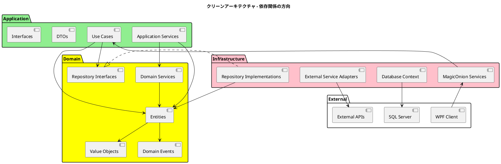
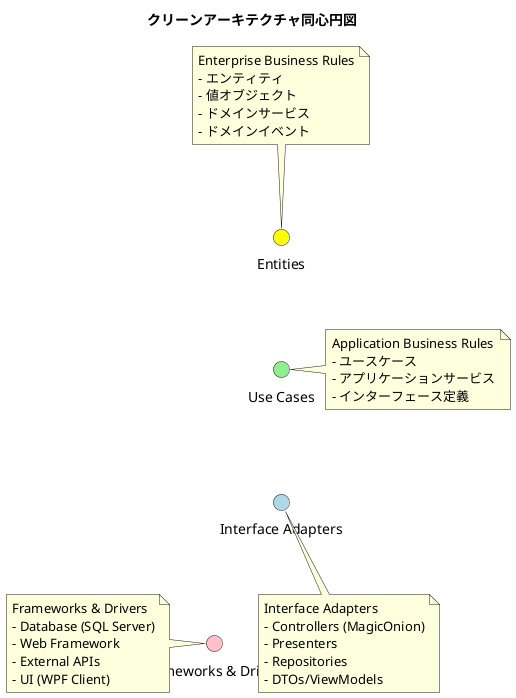
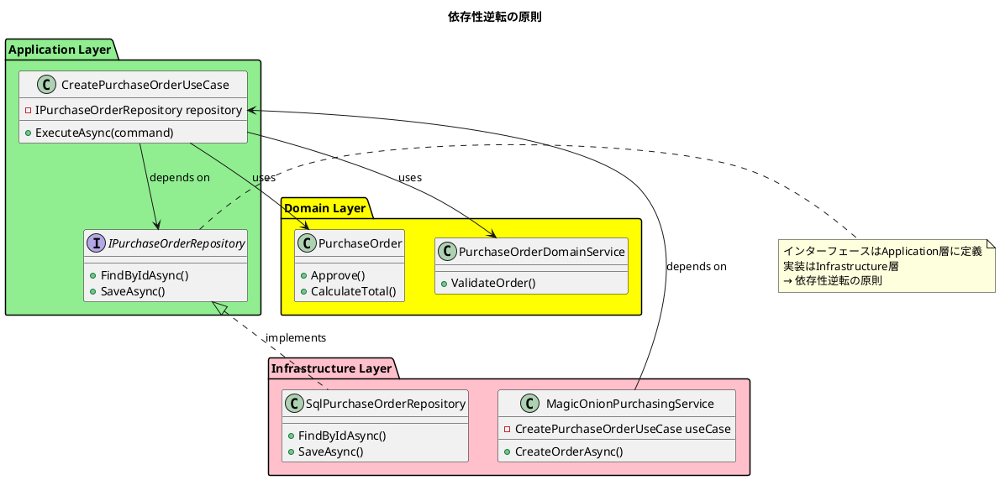
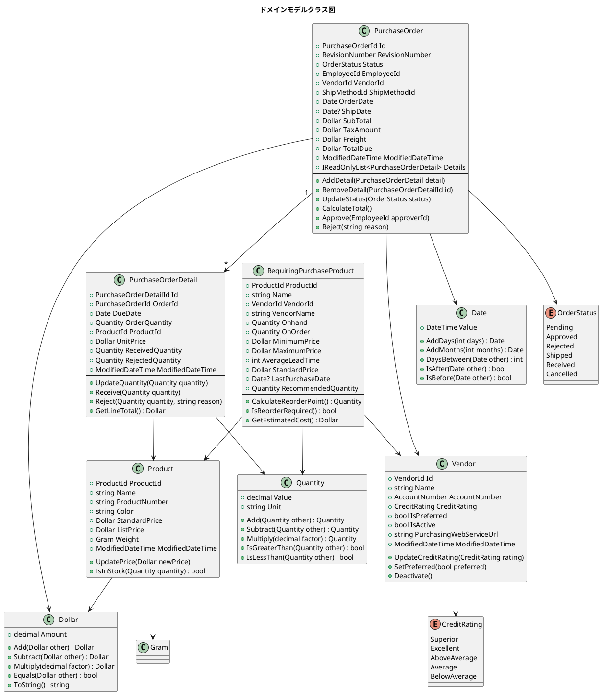
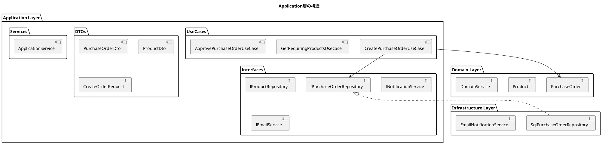
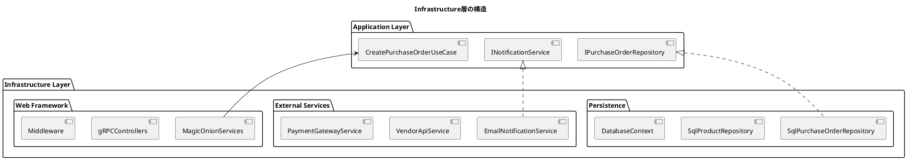
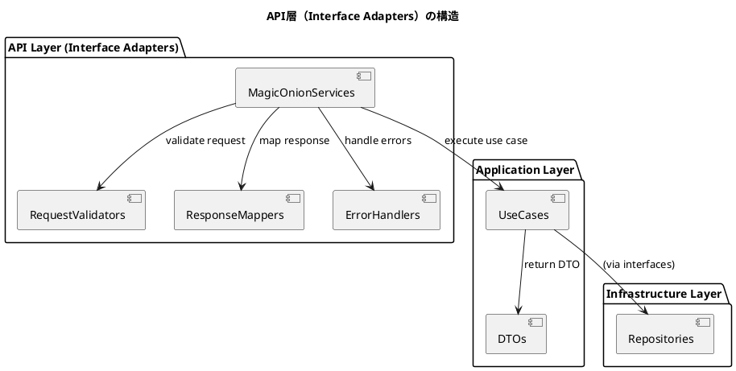
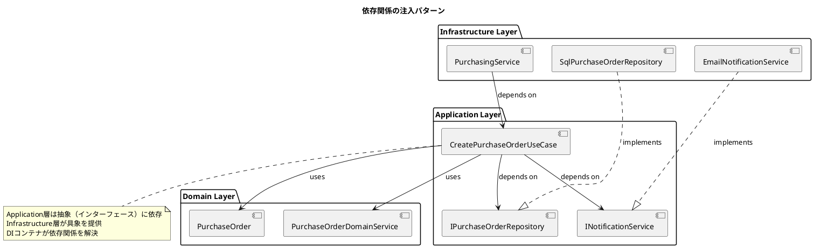
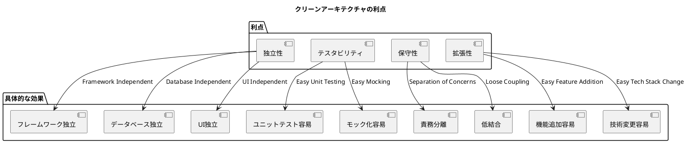
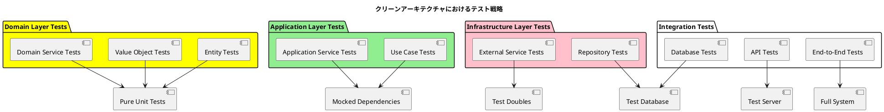

# バックエンドアーキテクチャ設計 - AdventureWorks 購買管理システム

## アーキテクチャ概要

### クリーンアーキテクチャ全体構成



### クリーンアーキテクチャの同心円構造



### 依存性逆転の実装



## ドメイン層設計

### ドメインモデル構造



### リポジトリインターフェース

```csharp
// Application層のリポジトリインターフェース（クリーンアーキテクチャ）
namespace AdventureWorks.Business.Purchasing.Application.Interfaces
{
    public interface IPurchaseOrderRepository
    {
        Task<PurchaseOrder?> FindByIdAsync(PurchaseOrderId id);
        Task<IReadOnlyList<PurchaseOrder>> GetPendingOrdersAsync();
        Task<IReadOnlyList<PurchaseOrder>> GetOrdersByVendorAsync(VendorId vendorId);
        Task<IReadOnlyList<PurchaseOrder>> GetOrdersByDateRangeAsync(Date startDate, Date endDate);
        Task SaveAsync(PurchaseOrder order);
        Task DeleteAsync(PurchaseOrderId id);
    }

    public interface IProductRepository
    {
        Task<Product?> FindByIdAsync(ProductId id);
        Task<IReadOnlyList<Product>> GetAllAsync();
        Task<IReadOnlyList<Product>> GetByCategoryAsync(ProductCategoryId categoryId);
        Task<IReadOnlyList<Product>> GetLowStockProductsAsync(Quantity threshold);
        Task SaveAsync(Product product);
    }

    public interface IRequiringPurchaseProductRepository
    {
        Task<IReadOnlyList<RequiringPurchaseProduct>> GetAllAsync();
        Task<IReadOnlyList<RequiringPurchaseProduct>> GetByVendorAsync(VendorId vendorId);
        Task<IReadOnlyList<RequiringPurchaseProduct>> GetCriticalItemsAsync();
    }

    public interface IVendorRepository
    {
        Task<Vendor?> FindByIdAsync(VendorId id);
        Task<IReadOnlyList<Vendor>> GetActiveVendorsAsync();
        Task<IReadOnlyList<Vendor>> GetPreferredVendorsAsync();
        Task SaveAsync(Vendor vendor);
    }
}
```

### ドメインサービス

```csharp
namespace AdventureWorks.Business.Purchasing.Domain.Services
{
    public class PurchaseOrderDomainService
    {
        private readonly IProductRepository _productRepository;
        private readonly IVendorRepository _vendorRepository;

        public PurchaseOrderDomainService(
            IProductRepository productRepository,
            IVendorRepository vendorRepository)
        {
            _productRepository = productRepository;
            _vendorRepository = vendorRepository;
        }

        public async Task<Dollar> CalculateOrderTotalAsync(PurchaseOrder order)
        {
            var subTotal = Dollar.Zero;

            foreach (var detail in order.Details)
            {
                var product = await _productRepository.FindByIdAsync(detail.ProductId);
                if (product != null)
                {
                    var lineTotal = detail.UnitPrice.Multiply(detail.OrderQuantity.Value);
                    subTotal = subTotal.Add(lineTotal);
                }
            }

            var taxAmount = subTotal.Multiply(0.08m); // 8% tax
            var totalDue = subTotal.Add(taxAmount).Add(order.Freight);

            return totalDue;
        }

        public async Task<bool> ValidateOrderAsync(PurchaseOrder order)
        {
            // ベンダーの検証
            var vendor = await _vendorRepository.FindByIdAsync(order.VendorId);
            if (vendor == null || !vendor.IsActive)
            {
                return false;
            }

            // 信用度チェック
            if (vendor.CreditRating == CreditRating.BelowAverage &&
                order.TotalDue.Amount > 10000m)
            {
                return false;
            }

            // 製品在庫チェック
            foreach (var detail in order.Details)
            {
                var product = await _productRepository.FindByIdAsync(detail.ProductId);
                if (product == null)
                {
                    return false;
                }
            }

            return true;
        }
    }

    public class ReorderingDomainService
    {
        public Quantity CalculateReorderPoint(
            Quantity averageDailyUsage,
            int leadTimeDays,
            Quantity safetyStock)
        {
            var leadTimeUsage = averageDailyUsage.Multiply(leadTimeDays);
            return leadTimeUsage.Add(safetyStock);
        }

        public Quantity CalculateEconomicOrderQuantity(
            Quantity annualDemand,
            Dollar orderingCost,
            Dollar holdingCostPerUnit)
        {
            // EOQ = sqrt((2 * D * S) / H)
            // D = Annual demand
            // S = Ordering cost per order
            // H = Holding cost per unit
            var numerator = annualDemand.Value * 2 * orderingCost.Amount;
            var denominator = holdingCostPerUnit.Amount;
            var eoq = Math.Sqrt((double)(numerator / denominator));

            return new Quantity((decimal)eoq, annualDemand.Unit);
        }
    }
}
```

## アプリケーション層設計（Use Cases）

### クリーンアーキテクチャにおけるApplication層の役割

Application層は以下の責務を持ちます：
- ビジネスユースケースの実装
- インターフェースの定義（Repository、External Services）
- ドメインオブジェクトの協調
- トランザクション管理
- DTOとドメインオブジェクトの変換



### ユースケース実装

```csharp
namespace AdventureWorks.Business.Purchasing.Application.UseCases
{
    public class CreatePurchaseOrderUseCase
    {
        private readonly IPurchaseOrderRepository _orderRepository;
        private readonly IRequiringPurchaseProductRepository _requiringRepository;
        private readonly PurchaseOrderDomainService _domainService;
        private readonly IUnitOfWork _unitOfWork;
        private readonly INotificationService _notificationService;

        public CreatePurchaseOrderUseCase(
            IPurchaseOrderRepository orderRepository,
            IRequiringPurchaseProductRepository requiringRepository,
            PurchaseOrderDomainService domainService,
            IUnitOfWork unitOfWork,
            INotificationService notificationService)
        {
            _orderRepository = orderRepository;
            _requiringRepository = requiringRepository;
            _domainService = domainService;
            _unitOfWork = unitOfWork;
            _notificationService = notificationService;
        }

        public async Task<CreatePurchaseOrderResult> ExecuteAsync(
            CreatePurchaseOrderCommand command)
        {
            try
            {
                // トランザクション開始
                await _unitOfWork.BeginTransactionAsync();

                // 要再発注製品の取得
                var requiringProducts = await _requiringRepository
                    .GetByVendorAsync(command.VendorId);

                if (!requiringProducts.Any())
                {
                    return new CreatePurchaseOrderResult
                    {
                        Success = false,
                        ErrorMessage = "発注対象の製品が見つかりません。"
                    };
                }

                // 発注の作成
                var order = new PurchaseOrder(
                    PurchaseOrderId.NewId(),
                    RevisionNumber.Initial,
                    OrderStatus.Pending,
                    command.EmployeeId,
                    command.VendorId,
                    command.ShipMethodId,
                    Date.Today,
                    null,
                    Dollar.Zero,
                    Dollar.Zero,
                    Dollar.Zero,
                    Dollar.Zero,
                    ModifiedDateTime.Now,
                    new List<PurchaseOrderDetail>());

                // 発注明細の追加
                foreach (var product in command.SelectedProducts)
                {
                    var detail = new PurchaseOrderDetail(
                        PurchaseOrderDetailId.NewId(),
                        order.Id,
                        command.DueDate,
                        product.Quantity,
                        product.ProductId,
                        product.UnitPrice,
                        Quantity.Zero,
                        Quantity.Zero,
                        ModifiedDateTime.Now);

                    order.AddDetail(detail);
                }

                // 合計金額の計算
                var totalDue = await _domainService.CalculateOrderTotalAsync(order);
                order = order with { TotalDue = totalDue };

                // 検証
                if (!await _domainService.ValidateOrderAsync(order))
                {
                    await _unitOfWork.RollbackTransactionAsync();
                    return new CreatePurchaseOrderResult
                    {
                        Success = false,
                        ErrorMessage = "発注の検証に失敗しました。"
                    };
                }

                // 保存
                await _orderRepository.SaveAsync(order);
                await _unitOfWork.CommitTransactionAsync();

                // 通知（外部サービス - Infrastructure層で実装）
                await _notificationService.NotifyOrderCreatedAsync(order.Id, order.VendorId);

                return new CreatePurchaseOrderResult
                {
                    Success = true,
                    OrderId = order.Id,
                    TotalAmount = order.TotalDue
                };
            }
            catch (Exception ex)
            {
                await _unitOfWork.RollbackTransactionAsync();
                throw new ApplicationException("発注の作成中にエラーが発生しました。", ex);
            }
        }
    }
}
```

### DTOとマッピング

```csharp
namespace AdventureWorks.Business.Purchasing.Application.DTOs
{
    public record PurchaseOrderDto
    {
        public string OrderId { get; init; }
        public string VendorName { get; init; }
        public string Status { get; init; }
        public DateTime OrderDate { get; init; }
        public DateTime? ShipDate { get; init; }
        public decimal SubTotal { get; init; }
        public decimal TaxAmount { get; init; }
        public decimal Freight { get; init; }
        public decimal TotalDue { get; init; }
        public List<PurchaseOrderDetailDto> Details { get; init; }
    }

    public record RequiringPurchaseProductDto
    {
        public string ProductId { get; init; }
        public string ProductName { get; init; }
        public string VendorName { get; init; }
        public decimal CurrentStock { get; init; }
        public decimal OnOrder { get; init; }
        public decimal RecommendedQuantity { get; init; }
        public decimal UnitPrice { get; init; }
        public int LeadTimeDays { get; init; }
    }

    public static class DtoMapper
    {
        public static PurchaseOrderDto ToDto(PurchaseOrder order, Vendor vendor)
        {
            return new PurchaseOrderDto
            {
                OrderId = order.Id.Value.ToString(),
                VendorName = vendor.Name,
                Status = order.Status.ToString(),
                OrderDate = order.OrderDate.Value,
                ShipDate = order.ShipDate?.Value,
                SubTotal = order.SubTotal.Amount,
                TaxAmount = order.TaxAmount.Amount,
                Freight = order.Freight.Amount,
                TotalDue = order.TotalDue.Amount,
                Details = order.Details.Select(d => ToDto(d)).ToList()
            };
        }

        public static RequiringPurchaseProductDto ToDto(RequiringPurchaseProduct product)
        {
            return new RequiringPurchaseProductDto
            {
                ProductId = product.ProductId.Value.ToString(),
                ProductName = product.Name,
                VendorName = product.VendorName,
                CurrentStock = product.Onhand.Value,
                OnOrder = product.OnOrder.Value,
                RecommendedQuantity = product.RecommendedQuantity.Value,
                UnitPrice = product.StandardPrice.Amount,
                LeadTimeDays = product.AverageLeadTime
            };
        }
    }
}
```

## インフラストラクチャ層設計（Frameworks & Drivers）

### クリーンアーキテクチャにおけるInfrastructure層の役割

Infrastructure層は最外周の層で、以下の責務を持ちます：
- Application層で定義されたインターフェースの実装
- データベースアクセス
- 外部サービスとの通信
- フレームワーク固有のコード
- WebフレームワークやORM等の技術詳細



### リポジトリ実装

```csharp
namespace AdventureWorks.Business.Purchasing.Infrastructure.Repositories
{
    // Application層のインターフェースを実装
    public class SqlPurchaseOrderRepository : IPurchaseOrderRepository
    {
        private readonly IPurchasingDbContext _context;

        public SqlPurchaseOrderRepository(IPurchasingDbContext context)
        {
            _context = context;
        }

        public async Task<PurchaseOrder?> FindByIdAsync(PurchaseOrderId id)
        {
            var sql = @"
                SELECT
                    po.PurchaseOrderID,
                    po.RevisionNumber,
                    po.Status,
                    po.EmployeeID,
                    po.VendorID,
                    po.ShipMethodID,
                    po.OrderDate,
                    po.ShipDate,
                    po.SubTotal,
                    po.TaxAmt,
                    po.Freight,
                    po.TotalDue,
                    po.ModifiedDate,
                    pod.PurchaseOrderDetailID,
                    pod.DueDate,
                    pod.OrderQty,
                    pod.ProductID,
                    pod.UnitPrice,
                    pod.ReceivedQty,
                    pod.RejectedQty
                FROM Purchasing.PurchaseOrderHeader po
                LEFT JOIN Purchasing.PurchaseOrderDetail pod
                    ON po.PurchaseOrderID = pod.PurchaseOrderID
                WHERE po.PurchaseOrderID = @PurchaseOrderID";

            var orderDict = new Dictionary<int, PurchaseOrderEntity>();

            var orders = await _context.Connection.QueryAsync<PurchaseOrderEntity, PurchaseOrderDetailEntity, PurchaseOrderEntity>(
                sql,
                (order, detail) =>
                {
                    if (!orderDict.TryGetValue(order.PurchaseOrderID, out var orderEntry))
                    {
                        orderEntry = order;
                        orderEntry.Details = new List<PurchaseOrderDetailEntity>();
                        orderDict.Add(order.PurchaseOrderID, orderEntry);
                    }

                    if (detail != null)
                    {
                        orderEntry.Details.Add(detail);
                    }

                    return orderEntry;
                },
                new { PurchaseOrderID = id.Value },
                splitOn: "PurchaseOrderDetailID");

            var result = orderDict.Values.FirstOrDefault();
            return result != null ? MapToDomain(result) : null;
        }

        public async Task SaveAsync(PurchaseOrder order)
        {
            if (await ExistsAsync(order.Id))
            {
                await UpdateAsync(order);
            }
            else
            {
                await InsertAsync(order);
            }
        }

        private async Task InsertAsync(PurchaseOrder order)
        {
            var sql = @"
                INSERT INTO Purchasing.PurchaseOrderHeader (
                    RevisionNumber, Status, EmployeeID, VendorID,
                    ShipMethodID, OrderDate, ShipDate, SubTotal,
                    TaxAmt, Freight, TotalDue, ModifiedDate
                ) VALUES (
                    @RevisionNumber, @Status, @EmployeeID, @VendorID,
                    @ShipMethodID, @OrderDate, @ShipDate, @SubTotal,
                    @TaxAmt, @Freight, @TotalDue, @ModifiedDate
                );
                SELECT SCOPE_IDENTITY();";

            var orderId = await _context.Connection.QuerySingleAsync<int>(sql, new
            {
                RevisionNumber = order.RevisionNumber.Value,
                Status = (int)order.Status,
                EmployeeID = order.EmployeeId.Value,
                VendorID = order.VendorId.Value,
                ShipMethodID = order.ShipMethodId.Value,
                OrderDate = order.OrderDate.Value,
                ShipDate = order.ShipDate?.Value,
                SubTotal = order.SubTotal.Amount,
                TaxAmt = order.TaxAmount.Amount,
                Freight = order.Freight.Amount,
                TotalDue = order.TotalDue.Amount,
                ModifiedDate = order.ModifiedDateTime.Value
            });

            // 明細の挿入
            foreach (var detail in order.Details)
            {
                await InsertDetailAsync(orderId, detail);
            }
        }

        private PurchaseOrder MapToDomain(PurchaseOrderEntity entity)
        {
            var details = entity.Details.Select(d => new PurchaseOrderDetail(
                new PurchaseOrderDetailId(d.PurchaseOrderDetailID),
                new PurchaseOrderId(entity.PurchaseOrderID),
                new Date(d.DueDate),
                new Quantity(d.OrderQty, "EA"),
                new ProductId(d.ProductID),
                new Dollar(d.UnitPrice),
                new Quantity(d.ReceivedQty, "EA"),
                new Quantity(d.RejectedQty, "EA"),
                new ModifiedDateTime(d.ModifiedDate)
            )).ToList();

            return new PurchaseOrder(
                new PurchaseOrderId(entity.PurchaseOrderID),
                new RevisionNumber(entity.RevisionNumber),
                (OrderStatus)entity.Status,
                new EmployeeId(entity.EmployeeID),
                new VendorId(entity.VendorID),
                new ShipMethodId(entity.ShipMethodID),
                new Date(entity.OrderDate),
                entity.ShipDate.HasValue ? new Date(entity.ShipDate.Value) : null,
                new Dollar(entity.SubTotal),
                new Dollar(entity.TaxAmt),
                new Dollar(entity.Freight),
                new Dollar(entity.TotalDue),
                new ModifiedDateTime(entity.ModifiedDate),
                details
            );
        }
    }
}
```

### Unit of Work パターン

```csharp
namespace AdventureWorks.Business.Purchasing.Infrastructure
{
    public interface IUnitOfWork
    {
        Task BeginTransactionAsync();
        Task CommitTransactionAsync();
        Task RollbackTransactionAsync();
    }

    public class UnitOfWork : IUnitOfWork, IDisposable
    {
        private readonly IDbConnection _connection;
        private IDbTransaction _transaction;

        public UnitOfWork(IDbConnection connection)
        {
            _connection = connection;
        }

        public async Task BeginTransactionAsync()
        {
            if (_connection.State != ConnectionState.Open)
            {
                _connection.Open();
            }
            _transaction = _connection.BeginTransaction();
            await Task.CompletedTask;
        }

        public async Task CommitTransactionAsync()
        {
            try
            {
                _transaction?.Commit();
                await Task.CompletedTask;
            }
            catch
            {
                _transaction?.Rollback();
                throw;
            }
            finally
            {
                _transaction?.Dispose();
                _transaction = null;
            }
        }

        public async Task RollbackTransactionAsync()
        {
            _transaction?.Rollback();
            _transaction?.Dispose();
            _transaction = null;
            await Task.CompletedTask;
        }

        public void Dispose()
        {
            _transaction?.Dispose();
            _connection?.Dispose();
        }
    }
}
```

### 外部サービス実装

```csharp
namespace AdventureWorks.Business.Purchasing.Infrastructure.Services
{
    // Application層のインターフェースを実装
    public class EmailNotificationService : INotificationService
    {
        private readonly IEmailSender _emailSender;
        private readonly IVendorRepository _vendorRepository;

        public EmailNotificationService(
            IEmailSender emailSender,
            IVendorRepository vendorRepository)
        {
            _emailSender = emailSender;
            _vendorRepository = vendorRepository;
        }

        public async Task NotifyOrderCreatedAsync(PurchaseOrderId orderId, VendorId vendorId)
        {
            var vendor = await _vendorRepository.FindByIdAsync(vendorId);
            if (vendor?.Email != null)
            {
                var subject = $"新しい発注が作成されました - 発注番号: {orderId.Value}";
                var body = $"発注番号 {orderId.Value} が作成されました。確認をお願いします。";

                await _emailSender.SendEmailAsync(vendor.Email, subject, body);
            }
        }
    }

    public class VendorApiService : IVendorApiService
    {
        private readonly HttpClient _httpClient;

        public VendorApiService(HttpClient httpClient)
        {
            _httpClient = httpClient;
        }

        public async Task<VendorProductInfo[]> GetProductCatalogAsync(VendorId vendorId)
        {
            var response = await _httpClient.GetAsync($"/vendors/{vendorId.Value}/products");
            var content = await response.Content.ReadAsStringAsync();
            return JsonSerializer.Deserialize<VendorProductInfo[]>(content);
        }
    }
}
```

## API層設計 (MagicOnion - Interface Adapters)

### クリーンアーキテクチャにおけるAPI層の役割

API層（Interface Adapters層）は、外部からのリクエストを受け取り、Application層のユースケースに変換する役割を持ちます：
- 外部からのリクエスト受信
- データの検証とマッピング
- ユースケースの呼び出し
- レスポンスの整形



### サービス実装

```csharp
namespace AdventureWorks.Business.Purchasing.Api.Services
{
    public interface IPurchasingService : IService<IPurchasingService>
    {
        UnaryResult<RequiringPurchaseProductDto[]> GetRequiringPurchaseProductsAsync();
        UnaryResult<PurchaseOrderDto> CreatePurchaseOrderAsync(CreatePurchaseOrderRequest request);
        UnaryResult<PurchaseOrderDto> GetPurchaseOrderAsync(int orderId);
        UnaryResult<ApprovalResult> ApprovePurchaseOrderAsync(int orderId, int approverId);
    }

    // Interface Adapters層 - 外部からの入力を受け取ってユースケースを実行
    public class PurchasingService : ServiceBase<IPurchasingService>, IPurchasingService
    {
        private readonly GetRequiringProductsUseCase _getRequiringProductsUseCase;
        private readonly CreatePurchaseOrderUseCase _createOrderUseCase;
        private readonly ApprovePurchaseOrderUseCase _approveOrderUseCase;
        private readonly GetPurchaseOrderUseCase _getOrderUseCase;

        public PurchasingService(
            GetRequiringProductsUseCase getRequiringProductsUseCase,
            CreatePurchaseOrderUseCase createOrderUseCase,
            ApprovePurchaseOrderUseCase approveOrderUseCase,
            GetPurchaseOrderUseCase getOrderUseCase)
        {
            _getRequiringProductsUseCase = getRequiringProductsUseCase;
            _createOrderUseCase = createOrderUseCase;
            _approveOrderUseCase = approveOrderUseCase;
            _getOrderUseCase = getOrderUseCase;
        }

        public async UnaryResult<RequiringPurchaseProductDto[]> GetRequiringPurchaseProductsAsync()
        {
            try
            {
                // Application層のユースケースを呼び出し
                var result = await _getRequiringProductsUseCase.ExecuteAsync();
                return result.Products;
            }
            catch (Exception ex)
            {
                throw new RpcException(new Status(StatusCode.Internal, ex.Message));
            }
        }

        public async UnaryResult<PurchaseOrderDto> CreatePurchaseOrderAsync(
            CreatePurchaseOrderRequest request)
        {
            try
            {
                var command = new CreatePurchaseOrderCommand
                {
                    VendorId = new VendorId(request.VendorId),
                    EmployeeId = new EmployeeId(request.EmployeeId),
                    ShipMethodId = new ShipMethodId(request.ShipMethodId),
                    DueDate = new Date(request.DueDate),
                    SelectedProducts = request.Products.Select(p => new SelectedProduct
                    {
                        ProductId = new ProductId(p.ProductId),
                        Quantity = new Quantity(p.Quantity, "EA"),
                        UnitPrice = new Dollar(p.UnitPrice)
                    }).ToList()
                };

                var result = await _createOrderUseCase.ExecuteAsync(command);

                if (!result.Success)
                {
                    throw new RpcException(
                        new Status(StatusCode.InvalidArgument, result.ErrorMessage));
                }

                // ユースケースが既にDTOを返すためそのまま返却
                return result.OrderDto;
            }
            catch (Exception ex)
            {
                throw new RpcException(new Status(StatusCode.Internal, ex.Message));
            }
        }
    }
}
```

### クリーンアーキテクチャでのDI構成

```csharp
namespace AdventureWorks.Business.Purchasing.Api
{
    public class Startup
    {
        public void ConfigureServices(IServiceCollection services)
        {
            // MagicOnion (Infrastructure Layer)
            services.AddMagicOnion();

            // External Dependencies (Infrastructure Layer)
            services.AddScoped<IDbConnection>(sp =>
                new SqlConnection(Configuration.GetConnectionString("AdventureWorks")));
            services.AddHttpClient<VendorApiService>();

            // Infrastructure Layer - Repository実装
            services.AddScoped<IPurchaseOrderRepository, SqlPurchaseOrderRepository>();
            services.AddScoped<IProductRepository, SqlProductRepository>();
            services.AddScoped<IRequiringPurchaseProductRepository, SqlRequiringPurchaseProductRepository>();
            services.AddScoped<IVendorRepository, SqlVendorRepository>();

            // Infrastructure Layer - External Service実装
            services.AddScoped<INotificationService, EmailNotificationService>();
            services.AddScoped<IVendorApiService, VendorApiService>();
            services.AddScoped<IUnitOfWork, UnitOfWork>();

            // Domain Layer - Domain Services
            services.AddScoped<PurchaseOrderDomainService>();
            services.AddScoped<ReorderingDomainService>();

            // Application Layer - Use Cases
            services.AddScoped<CreatePurchaseOrderUseCase>();
            services.AddScoped<ApprovePurchaseOrderUseCase>();
            services.AddScoped<GetRequiringProductsUseCase>();
            services.AddScoped<GetPurchaseOrderUseCase>();

            // Infrastructure Layer - API Services
            services.AddScoped<PurchasingService>();
            services.AddScoped<ProductService>();
            services.AddScoped<VendorService>();
        }

        public void Configure(IApplicationBuilder app, IWebHostEnvironment env)
        {
            if (env.IsDevelopment())
            {
                app.UseDeveloperExceptionPage();
            }

            app.UseRouting();

            app.UseEndpoints(endpoints =>
            {
                endpoints.MapMagicOnionService();
                endpoints.MapGrpcService<PurchasingService>();
                endpoints.MapGrpcService<ProductService>();
                endpoints.MapGrpcService<VendorService>();
            });
        }
    }
}
```

### クリーンアーキテクチャの依存関係管理



## クリーンアーキテクチャの利点とテスト戦略

### クリーンアーキテクチャの利点



### テスト戦略



### ユニットテスト例

```csharp
// Domain Layer のテスト例
[TestFixture]
public class PurchaseOrderTests
{
    [Test]
    public void AddDetail_Should_AddDetailToPurchaseOrder()
    {
        // Arrange
        var order = CreateTestPurchaseOrder();
        var detail = CreateTestPurchaseOrderDetail();

        // Act
        order.AddDetail(detail);

        // Assert
        Assert.That(order.Details.Count, Is.EqualTo(1));
        Assert.That(order.Details.First().Id, Is.EqualTo(detail.Id));
    }
}

// Application Layer のテスト例
[TestFixture]
public class CreatePurchaseOrderUseCaseTests
{
    private Mock<IPurchaseOrderRepository> _mockOrderRepository;
    private Mock<INotificationService> _mockNotificationService;
    private CreatePurchaseOrderUseCase _useCase;

    [SetUp]
    public void SetUp()
    {
        _mockOrderRepository = new Mock<IPurchaseOrderRepository>();
        _mockNotificationService = new Mock<INotificationService>();
        _useCase = new CreatePurchaseOrderUseCase(
            _mockOrderRepository.Object,
            _mockNotificationService.Object);
    }

    [Test]
    public async Task ExecuteAsync_Should_CreateOrderAndNotify()
    {
        // Arrange
        var command = CreateTestCommand();
        _mockOrderRepository.Setup(r => r.SaveAsync(It.IsAny<PurchaseOrder>()))
            .Returns(Task.CompletedTask);

        // Act
        var result = await _useCase.ExecuteAsync(command);

        // Assert
        Assert.That(result.Success, Is.True);
        _mockOrderRepository.Verify(r => r.SaveAsync(It.IsAny<PurchaseOrder>()), Times.Once);
        _mockNotificationService.Verify(
            n => n.NotifyOrderCreatedAsync(It.IsAny<PurchaseOrderId>(), It.IsAny<VendorId>()),
            Times.Once);
    }
}
```

## パフォーマンス最適化

### キャッシング戦略

```csharp
// Decorator パターンでキャッシュ機能を追加（Infrastructure層）
public class CachedProductRepository : IProductRepository
{
    private readonly IProductRepository _inner;
    private readonly IMemoryCache _cache;
    private readonly TimeSpan _cacheExpiration = TimeSpan.FromMinutes(5);

    public async Task<Product?> FindByIdAsync(ProductId id)
    {
        var cacheKey = $"product_{id.Value}";

        if (_cache.TryGetValue<Product>(cacheKey, out var cached))
        {
            return cached;
        }

        var product = await _inner.FindByIdAsync(id);

        if (product != null)
        {
            _cache.Set(cacheKey, product, _cacheExpiration);
        }

        return product;
    }
}
```

### 非同期処理最適化

```csharp
public class BatchPurchaseOrderProcessor
{
    private readonly SemaphoreSlim _semaphore = new(10); // 並列度制限

    public async Task<IEnumerable<ProcessResult>> ProcessOrdersAsync(
        IEnumerable<PurchaseOrder> orders)
    {
        var tasks = orders.Select(order => ProcessOrderWithThrottlingAsync(order));
        return await Task.WhenAll(tasks);
    }

    private async Task<ProcessResult> ProcessOrderWithThrottlingAsync(
        PurchaseOrder order)
    {
        await _semaphore.WaitAsync();
        try
        {
            return await ProcessOrderAsync(order);
        }
        finally
        {
            _semaphore.Release();
        }
    }
}
```

## セキュリティ実装

### 認証・認可

```csharp
public class AuthorizedPurchasingService : ServiceBase<IPurchasingService>, IPurchasingService
{
    [Authorize(Roles = "Purchaser,Manager")]
    public async UnaryResult<PurchaseOrderDto> CreatePurchaseOrderAsync(
        CreatePurchaseOrderRequest request)
    {
        var userId = Context.GetUserId();
        // 実装...
    }

    [Authorize(Roles = "Manager")]
    public async UnaryResult<ApprovalResult> ApprovePurchaseOrderAsync(
        int orderId, int approverId)
    {
        // マネージャーのみ承認可能
        // 実装...
    }
}
```

## まとめ

本バックエンドアーキテクチャ設計では、**クリーンアーキテクチャ**を採用し、以下の主要な設計決定を行いました：

### クリーンアーキテクチャの適用

1. **同心円構造**: Domain（中心）→ Application → Infrastructure（外側）の依存関係
2. **依存性逆転**: 内側の層が外側に依存せず、インターフェースを通じて協調
3. **責務分離**: 各層が明確な責務を持ち、関心を適切に分離

### 各層の設計決定

#### Domain層（Enterprise Business Rules）
- **エンティティ**: PurchaseOrder、Product等のビジネス中核概念
- **値オブジェクト**: Dollar、Quantity等の不変オブジェクト
- **ドメインサービス**: 複数エンティティにまたがるビジネスロジック

#### Application層（Application Business Rules）
- **ユースケース**: ビジネスユースケースの実装
- **インターフェース定義**: Repository、External Serviceの抽象化
- **DTOマッピング**: ドメインオブジェクトと外部世界の変換

#### Infrastructure層（Frameworks & Drivers）
- **Repository実装**: Application層インターフェースの具象実装
- **外部サービス**: Email、API等の外部連携実装
- **MagicOnion API**: gRPC通信の具体実装

### アーキテクチャの利点

1. **フレームワーク独立性**: データベースやWebフレームワークに依存しない
2. **テスタビリティ**: 各層が独立してテスト可能
3. **保守性**: 変更の影響範囲が局所化される
4. **拡張性**: 新機能追加時の既存コードへの影響を最小化

### 技術的特徴

- **MagicOnion RPC**: 型安全なgRPC通信
- **依存性注入**: DIコンテナによる疎結合の実現
- **ドメイン駆動設計**: ビジネス知識の明確な表現
- **Unit of Work**: トランザクション管理の一元化
- **キャッシング**: Decoratorパターンによるパフォーマンス最適化

この設計により、変更に強く、テスト容易で、長期保守可能なバックエンドシステムを実現します。