# フロントエンドアーキテクチャ設計 - AdventureWorks 購買管理システム

## アーキテクチャ概要

### フロントエンド技術スタック

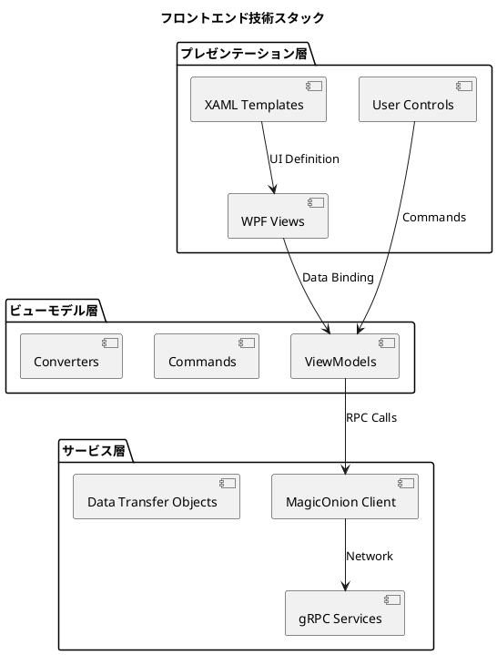

### アーキテクチャパターン

**Model-View-ViewModel (MVVM) パターン**

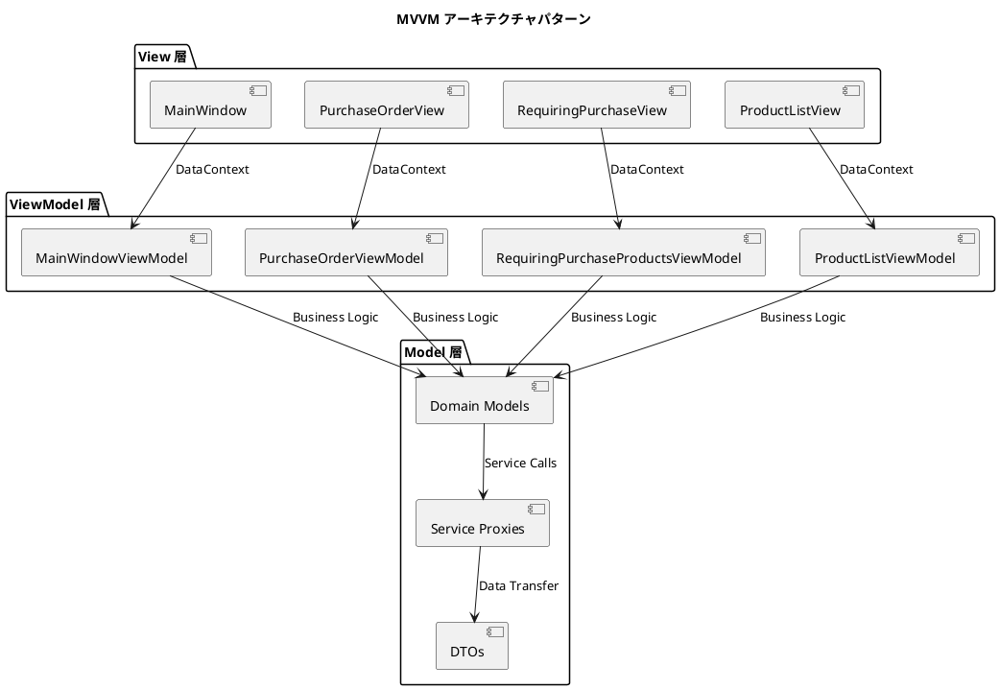

## View 層設計

### メイン画面構成

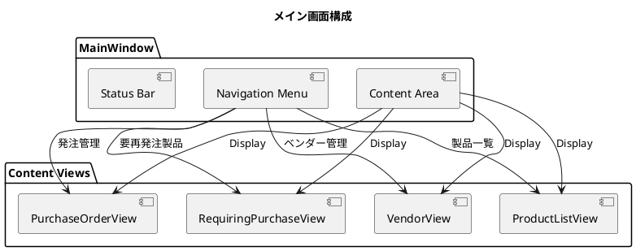

### View コンポーネント設計

#### 要再発注製品一覧画面

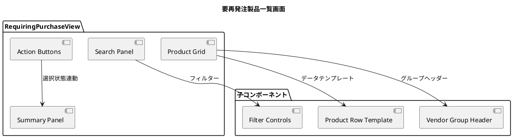

#### 発注作成画面

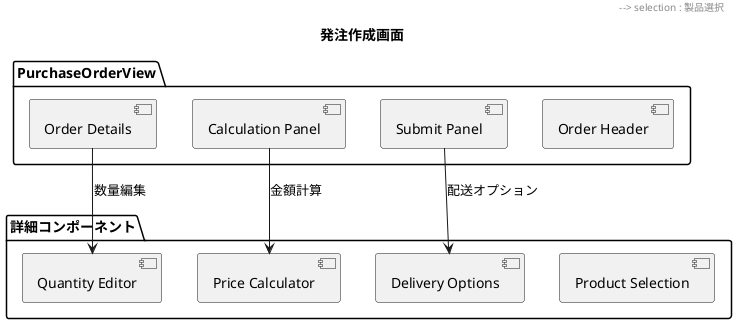

## ViewModel 層設計

### CommunityToolkit.Mvvm 活用

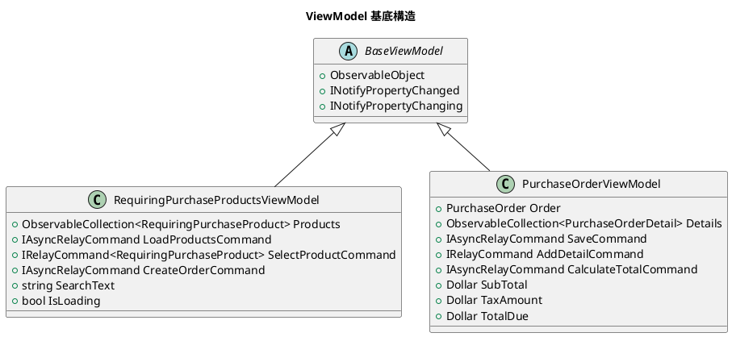

### Command パターン実装

```csharp
// 例: RequiringPurchaseProductsViewModel のコマンド実装
[RelayCommand]
private async Task LoadProducts()
{
    try
    {
        IsLoading = true;
        var products = await _purchasingService.GetRequiringPurchaseProductsAsync();
        Products.Clear();
        foreach (var product in products)
        {
            Products.Add(product);
        }
    }
    catch (Exception ex)
    {
        // エラーハンドリング
        await ShowErrorMessageAsync(ex.Message);
    }
    finally
    {
        IsLoading = false;
    }
}

[RelayCommand]
private void SelectProduct(RequiringPurchaseProduct product)
{
    if (product != null)
    {
        product.IsSelected = !product.IsSelected;
        UpdateTotalSelection();
    }
}

[RelayCommand]
private async Task CreateOrder()
{
    var selectedProducts = Products.Where(p => p.IsSelected).ToList();
    if (selectedProducts.Any())
    {
        await NavigateToOrderCreation(selectedProducts);
    }
}
```

### データバインディング設計

```xml
<!-- RequiringPurchaseView.xaml の例 -->
<UserControl>
    <Grid>
        <Grid.RowDefinitions>
            <RowDefinition Height="Auto"/>
            <RowDefinition Height="*"/>
            <RowDefinition Height="Auto"/>
        </Grid.RowDefinitions>

        <!-- 検索パネル -->
        <StackPanel Grid.Row="0" Orientation="Horizontal" Margin="10">
            <TextBox Text="{Binding SearchText, UpdateSourceTrigger=PropertyChanged}"
                     Width="200" Margin="5"/>
            <Button Content="検索" Command="{Binding LoadProductsCommand}" Margin="5"/>
        </StackPanel>

        <!-- 製品グリッド -->
        <DataGrid Grid.Row="1" ItemsSource="{Binding Products}"
                  AutoGenerateColumns="False" Margin="10">
            <DataGrid.Columns>
                <DataGridCheckBoxColumn Binding="{Binding IsSelected}" Header="選択"/>
                <DataGridTextColumn Binding="{Binding Name}" Header="製品名"/>
                <DataGridTextColumn Binding="{Binding VendorName}" Header="ベンダー"/>
                <DataGridTextColumn Binding="{Binding CurrentStock}" Header="現在在庫"/>
                <DataGridTextColumn Binding="{Binding RecommendedQuantity}" Header="推奨発注数"/>
                <DataGridTextColumn Binding="{Binding UnitPrice}" Header="単価"/>
            </DataGrid.Columns>
        </DataGrid>

        <!-- アクションパネル -->
        <StackPanel Grid.Row="2" Orientation="Horizontal"
                    HorizontalAlignment="Right" Margin="10">
            <TextBlock Text="{Binding SelectedCount, StringFormat='選択数: {0}'}"
                       Margin="10,0"/>
            <TextBlock Text="{Binding TotalAmount, StringFormat='合計金額: {0:C}'}"
                       Margin="10,0"/>
            <Button Content="発注する" Command="{Binding CreateOrderCommand}"
                    Margin="5" Padding="10,5"/>
        </StackPanel>
    </Grid>
</UserControl>
```

## サービス層設計

### MagicOnion クライアント実装

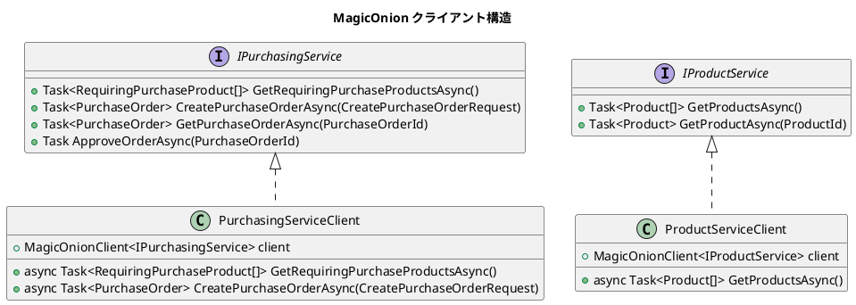

### サービスプロキシ実装例

```csharp
public class PurchasingServiceClient : IPurchasingService
{
    private readonly MagicOnionClient<IPurchasingService> _client;

    public PurchasingServiceClient(Channel channel)
    {
        _client = MagicOnionClient.Create<IPurchasingService>(channel);
    }

    public async Task<RequiringPurchaseProduct[]> GetRequiringPurchaseProductsAsync()
    {
        return await _client.GetRequiringPurchaseProductsAsync();
    }

    public async Task<PurchaseOrder> CreatePurchaseOrderAsync(CreatePurchaseOrderRequest request)
    {
        return await _client.CreatePurchaseOrderAsync(request);
    }

    public async Task<PurchaseOrder> GetPurchaseOrderAsync(PurchaseOrderId id)
    {
        return await _client.GetPurchaseOrderAsync(id);
    }

    public async Task ApproveOrderAsync(PurchaseOrderId id)
    {
        await _client.ApproveOrderAsync(id);
    }
}
```

## UI/UX 設計原則

### レスポンシブ設計

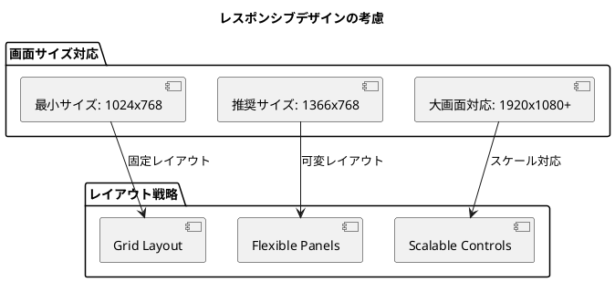

### アクセシビリティ対応

```xml
<!-- アクセシビリティ考慮の例 -->
<Button Content="発注作成"
        Command="{Binding CreateOrderCommand}"
        AutomationProperties.Name="発注作成ボタン"
        AutomationProperties.HelpText="選択した製品の発注を作成します"
        ToolTip="選択した製品の発注を作成"
        TabIndex="1"/>

<DataGrid ItemsSource="{Binding Products}"
          AutomationProperties.Name="要再発注製品一覧"
          AutomationProperties.HelpText="発注が必要な製品の一覧を表示"
          TabIndex="2">
```

### エラーハンドリング UI

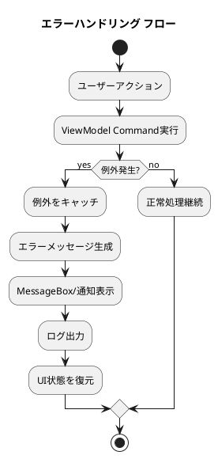

```csharp
// エラーハンドリング実装例
public class BaseViewModel : ObservableObject
{
    protected async Task ExecuteWithErrorHandling(Func<Task> operation,
        string errorTitle = "エラー")
    {
        try
        {
            await operation();
        }
        catch (ServiceException ex)
        {
            await ShowErrorMessage(errorTitle, ex.Message);
            Logger.LogError(ex, "Service error in {ViewModel}", GetType().Name);
        }
        catch (Exception ex)
        {
            await ShowErrorMessage(errorTitle, "予期しないエラーが発生しました。");
            Logger.LogError(ex, "Unexpected error in {ViewModel}", GetType().Name);
        }
    }

    private async Task ShowErrorMessage(string title, string message)
    {
        await Application.Current.Dispatcher.InvokeAsync(() =>
        {
            MessageBox.Show(message, title, MessageBoxButton.OK, MessageBoxImage.Error);
        });
    }
}
```

## パフォーマンス最適化

### データ仮想化

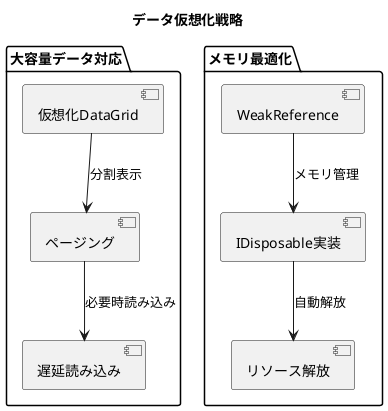

### 非同期処理パターン

```csharp
// 非同期パターンの実装例
public partial class RequiringPurchaseProductsViewModel : BaseViewModel
{
    private CancellationTokenSource _loadingCancellation;

    [RelayCommand]
    private async Task LoadProducts()
    {
        // 既存の読み込みをキャンセル
        _loadingCancellation?.Cancel();
        _loadingCancellation = new CancellationTokenSource();

        try
        {
            IsLoading = true;

            // プログレス表示
            var progress = new Progress<int>(percentage => LoadingProgress = percentage);

            // 非同期でデータ取得
            var products = await _purchasingService
                .GetRequiringPurchaseProductsAsync(_loadingCancellation.Token, progress);

            // UIスレッドで更新
            await Application.Current.Dispatcher.InvokeAsync(() =>
            {
                Products.Clear();
                foreach (var product in products)
                {
                    Products.Add(product);
                }
            });
        }
        catch (OperationCanceledException)
        {
            // キャンセル時は無視
        }
        catch (Exception ex)
        {
            await ShowErrorMessage("データ読み込みエラー", ex.Message);
        }
        finally
        {
            IsLoading = false;
        }
    }
}
```

## セキュリティ考慮事項

### 認証・認可

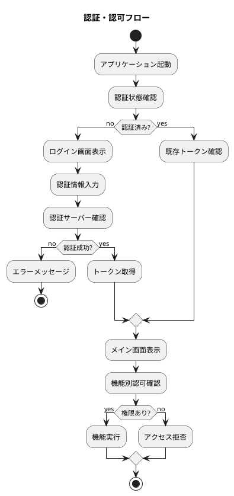

### データ保護

```csharp
// セキュアなデータハンドリング例
public class SecureDataHandler
{
    // 機密データの暗号化
    public string EncryptSensitiveData(string data)
    {
        // 暗号化ロジック
        return Convert.ToBase64String(
            ProtectedData.Protect(Encoding.UTF8.GetBytes(data), null, DataProtectionScope.CurrentUser));
    }

    // メモリからの機密データクリア
    public void ClearSensitiveData(SecureString secureString)
    {
        secureString?.Clear();
        secureString?.Dispose();
    }

    // 入力値検証
    public bool ValidateInput(string input)
    {
        if (string.IsNullOrWhiteSpace(input)) return false;

        // SQLインジェクション対策
        var sqlInjectionPattern = @"['"";\-\-]";
        if (Regex.IsMatch(input, sqlInjectionPattern)) return false;

        return true;
    }
}
```

## テスト戦略

### ViewModel 単体テスト

```csharp
// ViewModel テストの例
[TestFixture]
public class RequiringPurchaseProductsViewModelTests
{
    private RequiringPurchaseProductsViewModel _viewModel;
    private Mock<IPurchasingService> _mockService;

    [SetUp]
    public void SetUp()
    {
        _mockService = new Mock<IPurchasingService>();
        _viewModel = new RequiringPurchaseProductsViewModel(_mockService.Object);
    }

    [Test]
    public async Task LoadProducts_Should_PopulateProductsList()
    {
        // Arrange
        var expectedProducts = new[]
        {
            new RequiringPurchaseProduct(/* パラメータ */),
            new RequiringPurchaseProduct(/* パラメータ */)
        };
        _mockService.Setup(s => s.GetRequiringPurchaseProductsAsync())
            .ReturnsAsync(expectedProducts);

        // Act
        await _viewModel.LoadProductsCommand.ExecuteAsync(null);

        // Assert
        Assert.That(_viewModel.Products.Count, Is.EqualTo(2));
        Assert.That(_viewModel.IsLoading, Is.False);
    }

    [Test]
    public void SelectProduct_Should_ToggleSelection()
    {
        // Arrange
        var product = new RequiringPurchaseProduct(/* パラメータ */);
        _viewModel.Products.Add(product);

        // Act
        _viewModel.SelectProductCommand.Execute(product);

        // Assert
        Assert.That(product.IsSelected, Is.True);
    }
}
```

### UI テスト戦略

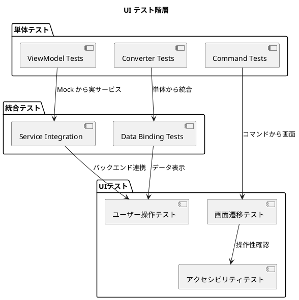

## デプロイメント考慮事項

### アプリケーション配布

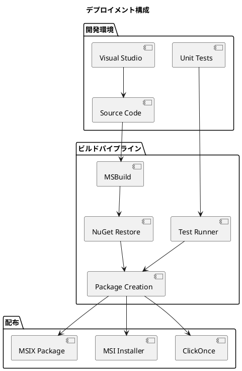

### 設定管理

```json
// appsettings.json の例
{
  "Logging": {
    "LogLevel": {
      "Default": "Information",
      "Microsoft": "Warning",
      "Microsoft.Hosting.Lifetime": "Information"
    }
  },
  "MagicOnion": {
    "ServerAddress": "https://localhost:5001",
    "Timeout": "00:00:30",
    "MaxRetryAttempts": 3
  },
  "UI": {
    "Theme": "Light",
    "Language": "ja-JP",
    "PageSize": 50
  },
  "Features": {
    "EnableAutoSave": true,
    "EnableOfflineMode": false,
    "EnableAdvancedFiltering": true
  }
}
```

## まとめ

本フロントエンドアーキテクチャ設計では、以下の主要な設計決定を行いました：

1. **MVVM パターンの採用**: データバインディングとコマンドパターンによる疎結合設計
2. **CommunityToolkit.Mvvm の活用**: 最新のMVVMライブラリによる生産性向上
3. **MagicOnion クライアント**: 型安全なRPC通信によるバックエンド連携
4. **レスポンシブUI**: 様々な画面サイズに対応する柔軟なレイアウト
5. **非同期パターン**: ユーザー体験を損なわない非ブロッキング処理
6. **エラーハンドリング**: 堅牢なエラー処理とユーザーフレンドリーなメッセージ
7. **テスト戦略**: 単体テストから統合テストまでの包括的テストアプローチ

この設計により、保守性が高く、拡張可能で、ユーザビリティに優れた購買管理システムのフロントエンドを実現します。