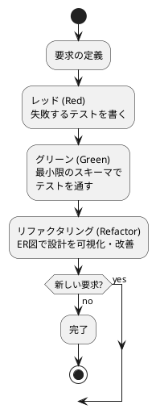
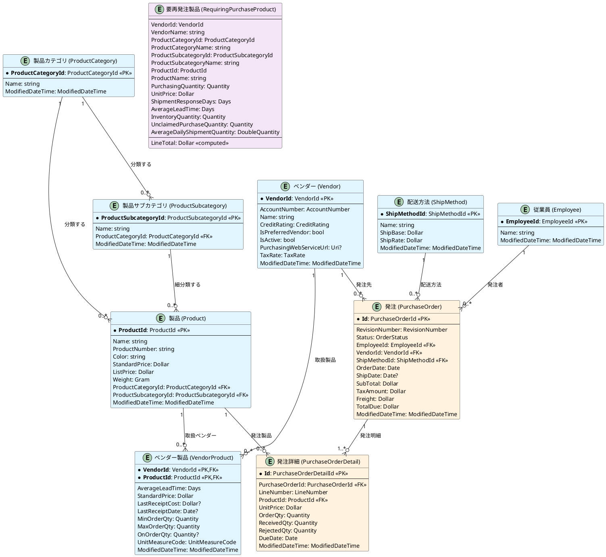
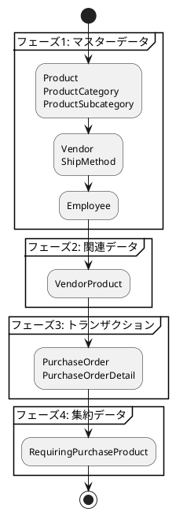

# データモデル設計書 - AdventureWorks 購買管理システム

## 概要

本ドキュメントは、AdventureWorks 購買管理システムのデータモデル設計を記述します。TDD（Test-Driven Development）アプローチを用いて、要求の変化に柔軟に対応できる堅牢なデータモデルを段階的に構築します。

## 設計方針

### TDD データベース設計サイクル



### 設計原則

1. **小さく始める**: 完璧な初期設計を目指さず、最小限の要求から開始
2. **テストファースト**: 要求をテストコードで明確に定義
3. **段階的改善**: テストに守られながら継続的にスキーマを改善
4. **可視化**: ER図で設計の全体像を把握
5. **一貫性**: 命名規則や設計パターンを統一

## ドメインエンティティ分析

### 既存ドメインエンティティ

Source フォルダの分析結果に基づく主要エンティティ：

#### マスターデータ
- **Product（製品）**: 購買対象となる製品情報
- **Vendor（ベンダー）**: 購買先業者情報
- **ShipMethod（配送方法）**: 配送手段情報
- **ProductCategory（製品カテゴリ）**: 製品分類情報
- **ProductSubcategory（製品サブカテゴリ）**: 製品細分類情報

#### トランザクションデータ
- **PurchaseOrder（発注）**: 発注ヘッダ情報
- **PurchaseOrderDetail（発注詳細）**: 発注明細情報
- **VendorProduct（ベンダー製品）**: ベンダー別製品取扱情報

#### 集約データ
- **RequiringPurchaseProduct（要再発注製品）**: 再発注が必要な製品集約情報

#### 値オブジェクト
- **ProductId**: 製品ID
- **VendorId**: ベンダーID
- **PurchaseOrderId**: 発注ID
- **OrderStatus**: 注文ステータス
- **CreditRating**: 信用格付
- **AccountNumber**: 会計番号

## データモデル設計

### 全体ER図



### マスターデータ設計パターン

#### 1. 製品マスター（Product）

**設計パターン**: 階層分類管理
- 製品カテゴリ → 製品サブカテゴリ → 製品 の階層構造
- 価格情報（標準価格、定価）を製品レベルで管理

**テスト例**:
```csharp
[Test]
public async Task 製品を登録できる()
{
    // Arrange
    var product = new Product(
        ProductId.NewId(),
        "テスト製品",
        "TEST-001",
        "Red",
        new Dollar(100.00m),
        new Dollar(150.00m),
        new Gram(500),
        ModifiedDateTime.Now()
    );

    // Act
    await _productRepository.SaveAsync(product);

    // Assert
    var saved = await _productRepository.FindByIdAsync(product.ProductId);
    Assert.That(saved, Is.EqualTo(product));
}
```

#### 2. ベンダーマスター（Vendor）

**設計パターン**: 取引先管理
- ベンダー基本情報と製品取扱情報を分離
- 信用格付け、優先ベンダーフラグによるランク管理

**テスト例**:
```csharp
[Test]
public async Task ベンダー製品関連を含めて取得できる()
{
    // Arrange
    var vendor = CreateTestVendor();
    var products = CreateTestProducts();

    // Act
    await _vendorRepository.SaveAsync(vendor);

    // Assert
    var loaded = await _vendorRepository.FindByIdWithProductsAsync(vendor.VendorId);
    Assert.That(loaded.VendorProducts, Has.Count.EqualTo(products.Count));
}
```

### トランザクションデータ設計パターン

#### 1. 発注ヘッダ・明細パターン

**設計パターン**: ヘッダ・明細分離
- 発注情報（PurchaseOrder）: 発注全体の情報
- 発注詳細（PurchaseOrderDetail）: 発注する製品ごとの詳細情報

**金額計算ロジック**:
```csharp
public Dollar TotalDue => SubTotal + TaxAmount + Freight;
public Dollar LineTotal => UnitPrice * OrderQty; // 明細レベル
```

**テスト例**:
```csharp
[Test]
public async Task 発注を作成できる()
{
    // Arrange
    var details = new List<PurchaseOrderDetail>
    {
        new(ProductId.NewId(), new Dollar(100m), new Quantity(5)),
        new(ProductId.NewId(), new Dollar(200m), new Quantity(3))
    };

    var order = PurchaseOrder.NewOrder(
        EmployeeId.NewId(),
        VendorId.NewId(),
        ShipMethodId.NewId(),
        Date.Today(),
        new Dollar(1100m), // SubTotal
        new Dollar(110m),  // TaxAmount
        new Dollar(50m),   // Freight
        details
    );

    // Act
    await _purchaseOrderRepository.SaveAsync(order);

    // Assert
    var saved = await _purchaseOrderRepository.FindByIdAsync(order.Id);
    Assert.That(saved.TotalDue, Is.EqualTo(new Dollar(1260m)));
    Assert.That(saved.Details, Has.Count.EqualTo(2));
}
```

#### 2. 注文ステータス管理

**設計パターン**: ステートマシン
- OrderStatus値オブジェクトによる状態管理
- 状態遷移のビジネスルールを適用

```csharp
public enum OrderStatus
{
    Pending = 1,     // 保留中
    Approved = 2,    // 承認済み
    Rejected = 3,    // 却下
    Complete = 4     // 完了
}
```

### 集約データ設計パターン

#### 要再発注製品（RequiringPurchaseProduct）

**設計パターン**: 読み取り専用集約
- 複数のマスター・トランザクションデータから集約
- ビジネスロジック（LineTotal計算）を含む読み取り専用モデル

**集約データソース**:
- Product（製品情報）
- Vendor（ベンダー情報）
- VendorProduct（ベンダー別製品情報）
- Inventory（在庫情報）
- PurchaseOrder（未完了発注情報）

## テスト戦略

### 1. 単体テスト（Unit Test）

```csharp
[TestFixture]
public class ProductTests
{
    [Test]
    public void 製品の小計計算が正しい()
    {
        // Arrange
        var unitPrice = new Dollar(100m);
        var quantity = new Quantity(5);

        // Act
        var lineTotal = unitPrice * quantity;

        // Assert
        Assert.That(lineTotal, Is.EqualTo(new Dollar(500m)));
    }
}
```

### 2. 統合テスト（Integration Test）

```csharp
[TestFixture]
public class PurchaseOrderIntegrationTests
{
    private IServiceProvider _serviceProvider;

    [SetUp]
    public void SetUp()
    {
        _serviceProvider = CreateTestServiceProvider();
    }

    [Test]
    public async Task 発注プロセス全体が正常に動作する()
    {
        // Arrange
        var productRepository = _serviceProvider.GetService<IProductRepository>();
        var vendorRepository = _serviceProvider.GetService<IVendorRepository>();
        var purchaseOrderRepository = _serviceProvider.GetService<IPurchaseOrderRepository>();

        var product = await CreateTestProduct(productRepository);
        var vendor = await CreateTestVendor(vendorRepository);

        // Act
        var order = await CreatePurchaseOrder(purchaseOrderRepository, product, vendor);

        // Assert
        Assert.That(order.Status, Is.EqualTo(OrderStatus.Pending));
        Assert.That(order.Details, Has.Count.GreaterThan(0));
    }
}
```

## データ移行戦略

### 段階的移行プロセス



### 移行検証テスト

```csharp
[Test]
public async Task データ移行の整合性を確認する()
{
    // Arrange
    var migrationService = _serviceProvider.GetService<IMigrationService>();

    // Act
    await migrationService.MigrateAllAsync();

    // Assert
    await ValidateDataConsistency();
    await ValidateReferentialIntegrity();
    await ValidateBusinessRules();
}
```

## パフォーマンス考慮事項

### インデックス設計

```sql
-- 主要検索パターン用インデックス
CREATE INDEX IX_Product_CategoryId ON Product (ProductCategoryId);
CREATE INDEX IX_PurchaseOrder_VendorId_OrderDate ON PurchaseOrder (VendorId, OrderDate);
CREATE INDEX IX_VendorProduct_ProductId ON VendorProduct (ProductId);

-- 要再発注製品集約用インデックス
CREATE INDEX IX_Product_Category_Subcategory ON Product (ProductCategoryId, ProductSubcategoryId);
CREATE INDEX IX_PurchaseOrderDetail_ProductId_Status ON PurchaseOrderDetail (ProductId)
    WHERE Status IN ('Pending', 'Approved');
```

### クエリ最適化

```csharp
// 効率的な要再発注製品取得
public async Task<IEnumerable<RequiringPurchaseProduct>> GetRequiringPurchaseProductsAsync()
{
    const string sql = @"
        SELECT
            v.VendorId,
            v.Name AS VendorName,
            pc.ProductCategoryId,
            pc.Name AS ProductCategoryName,
            psc.ProductSubcategoryId,
            psc.Name AS ProductSubcategoryName,
            p.ProductId,
            p.Name AS ProductName,
            vp.MinOrderQty AS PurchasingQuantity,
            vp.StandardPrice AS UnitPrice,
            vp.AverageLeadTime AS ShipmentResponseDays,
            -- 集約計算
        FROM Vendor v
        INNER JOIN VendorProduct vp ON v.VendorId = vp.VendorId
        INNER JOIN Product p ON vp.ProductId = p.ProductId
        INNER JOIN ProductCategory pc ON p.ProductCategoryId = pc.ProductCategoryId
        INNER JOIN ProductSubcategory psc ON p.ProductSubcategoryId = psc.ProductSubcategoryId
        WHERE v.IsActive = 1
        AND EXISTS (
            -- 在庫不足条件
            SELECT 1 FROM Inventory i
            WHERE i.ProductId = p.ProductId
            AND i.Quantity < i.SafetyStockLevel
        )";

    return await _connection.QueryAsync<RequiringPurchaseProduct>(sql);
}
```

## 監査・履歴管理

### 監査証跡設計

```csharp
public abstract record AuditableEntity
{
    public ModifiedDateTime ModifiedDateTime { get; init; }
    public string? CreatedBy { get; init; }
    public string? ModifiedBy { get; init; }
}

public record Product : AuditableEntity
{
    // 製品固有プロパティ
}
```

### 変更履歴テスト

```csharp
[Test]
public async Task エンティティ変更時に監査情報が更新される()
{
    // Arrange
    var product = CreateTestProduct();
    await _repository.SaveAsync(product);

    // Act
    var updated = product with { Name = "更新された製品名" };
    await _repository.SaveAsync(updated);

    // Assert
    var saved = await _repository.FindByIdAsync(product.ProductId);
    Assert.That(saved.ModifiedDateTime, Is.GreaterThan(product.ModifiedDateTime));
}
```

## まとめ

本データモデル設計書では、TDD アプローチに基づく段階的なデータベース設計プロセスを定義しました。

### 主要成果物

1. **マスターデータ設計**: Product、Vendor、ShipMethod などの基盤データ
2. **トランザクションデータ設計**: PurchaseOrder、PurchaseOrderDetail によるヘッダ・明細パターン
3. **集約データ設計**: RequiringPurchaseProduct による読み取り専用集約
4. **テスト戦略**: 単体テスト、統合テストによる品質保証
5. **パフォーマンス設計**: インデックス、クエリ最適化戦略

### 今後の拡張計画

1. **在庫管理**: Inventory エンティティの追加
2. **承認ワークフロー**: ApprovalProcess エンティティの追加
3. **入荷管理**: Receipt エンティティの追加
4. **レポート機能**: 分析用ビューとサマリテーブルの追加

このデータモデルは、要求の変化に対応できる柔軟性を持ちながら、購買管理システムの核となる堅牢な基盤を提供します。