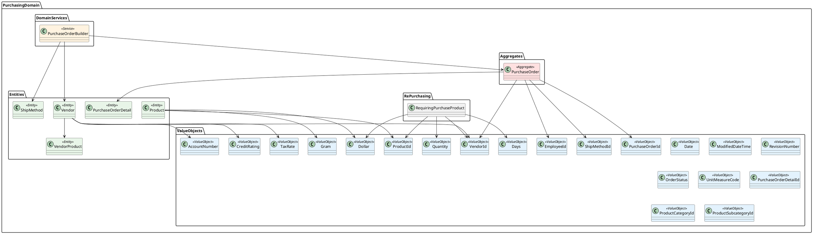
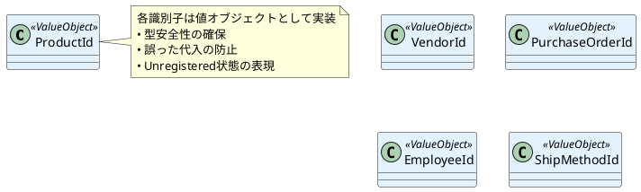
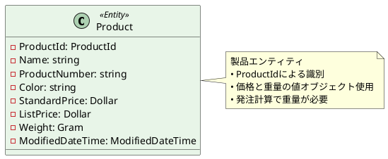
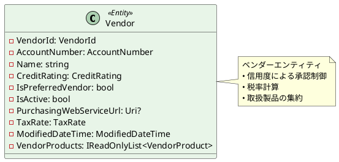
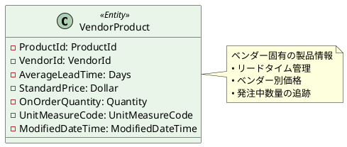
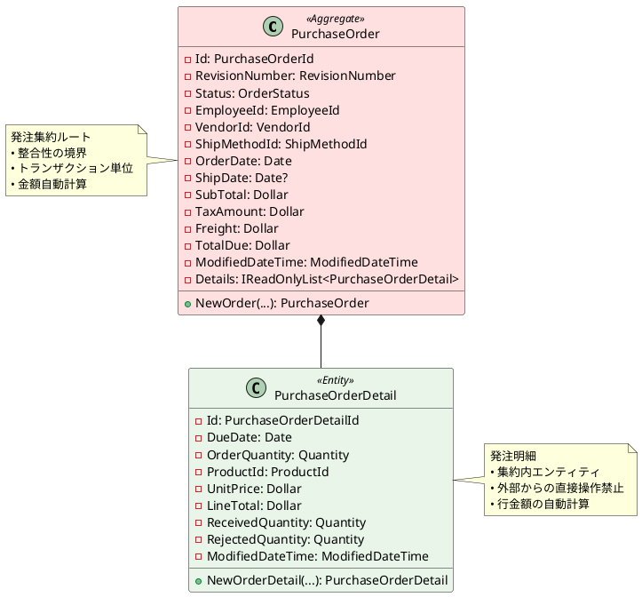
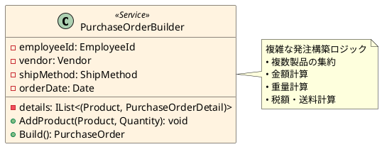
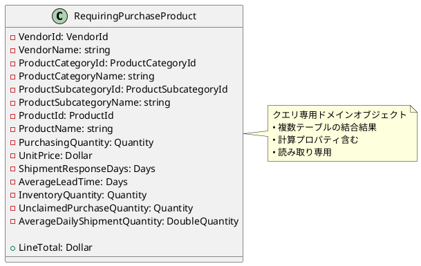
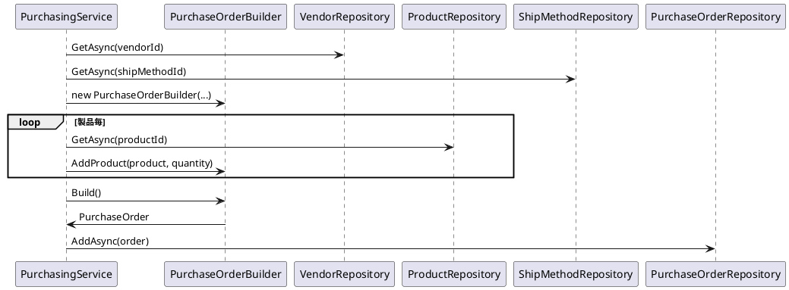
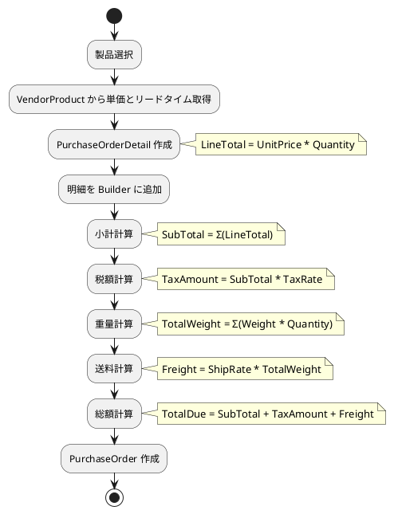

# ドメインモデル設計

## 概要

本ドキュメントは、AdventureWorks 購買管理システムのドメインモデル設計を記述します。
ボトムアップアプローチを採用し、値オブジェクトから始めて段階的にエンティティ、集約、ドメインサービスへと構築しています。

## ドメインモデル全体構造



## 値オブジェクト（Value Objects）

### 金額系値オブジェクト

#### Dollar

```csharp
/// <summary>
/// Dollar
/// </summary>
[UnitOf(typeof(decimal))]
public partial struct Dollar
{
    /// <summary>
    /// 加算
    /// </summary>
    public static Dollar operator +(Dollar z, Dollar w)
    {
        return new Dollar(z.value + w.value);
    }

    /// <summary>
    /// 減算
    /// </summary>
    public static Dollar operator -(Dollar z, Dollar w)
    {
        return new Dollar(z.value - w.value);
    }

    /// <summary>
    /// 乗算
    /// </summary>
    public static Dollar operator *(Dollar z, Quantity quantity)
    {
        return new Dollar(z.value * quantity.AsPrimitive());
    }

    /// <summary>
    /// 税額の計算
    /// </summary>
    public static Dollar operator *(Dollar z, TaxRate taxRate)
    {
        return new Dollar(z.value * taxRate.AsPrimitive() / 100);
    }
}
```

**設計意図**：
- 金額計算の型安全性を確保
- 数量や税率との演算を明示的に定義
- 業務固有の計算ロジックをカプセル化

### 数量系値オブジェクト

#### Quantity
- 発注数量、在庫数量を表現
- 負の値を防ぐバリデーションを含む

#### Gram
- 製品重量を表現
- 送料計算で使用

#### Days
- リードタイム、配送日数を表現
- 日付計算で使用

### 識別子値オブジェクト



### ビジネスルール値オブジェクト

#### OrderStatus
```csharp
public enum OrderStatus
{
    Pending,     // 承認待ち
    Approved,    // 承認済み
    Rejected,    // 差し戻し
    Complete     // 完了
}
```

#### CreditRating
- ベンダーの信用度を1-5の範囲で表現
- 信用度に基づく承認ルールで使用

## エンティティ（Entities）

### Product（製品）



**設計意図**：
- 製品固有の属性をカプセル化
- 価格と重量を値オブジェクトで型安全に管理
- 発注計算における重量の重要性を反映

### Vendor（ベンダー）



**設計意図**：
- ベンダー固有のビジネスルール（信用度、税率）をカプセル化
- 取扱製品との関係を明示
- 優先ベンダーの概念を表現

### VendorProduct（ベンダー製品）



**設計意図**：
- ベンダー毎の製品固有情報を管理
- 発注時のリードタイム計算で使用
- 価格とリードタイムのベンダー差を表現

## 集約（Aggregates）

### PurchaseOrder集約



**集約の設計原則**：
1. **整合性境界**: 発注と明細の整合性を保証
2. **トランザクション単位**: 発注全体が一つのトランザクション
3. **集約ルートアクセス**: PurchaseOrderを通じてのみ明細にアクセス
4. **不変条件**: 小計、税額、送料、総額の整合性を維持

### 発注の生成ファクトリメソッド

```csharp
/// <summary>
/// 新規の発注をインスタンス化する。
/// </summary>
public static PurchaseOrder NewOrder(
    EmployeeId employeeId,
    VendorId vendorId,
    ShipMethodId shipMethodId,
    Date orderDate,
    Dollar subTotal,
    Dollar taxAmount,
    Dollar freight,
    IReadOnlyList<PurchaseOrderDetail> details)
{
    return new(
        PurchaseOrderId.Unregistered,
        RevisionNumber.Unregistered,
        OrderStatus.Pending,
        employeeId,
        vendorId,
        shipMethodId,
        orderDate,
        null,
        subTotal,
        taxAmount,
        freight,
        subTotal + taxAmount + freight,  // 総額自動計算
        ModifiedDateTime.Unregistered,
        details);
}
```

**設計意図**：
- 新規発注の初期状態を統一
- 総額計算のビジネスルールを集約
- 未登録状態の明示的表現

## ドメインサービス（Domain Services）

### PurchaseOrderBuilder（発注ビルダー）



**実装例**：
```csharp
/// <summary>
/// 発注する商品を追加する。
/// </summary>
public void AddProduct(Product product, Quantity quantity)
{
    var vendorProduct = _vendor
        .VendorProducts
        .Single(x => x.ProductId == product.ProductId);
    _details.Add(
        (
            product,
            PurchaseOrderDetail.NewOrderDetail(
                _orderDate + vendorProduct.AverageLeadTime,  // 納期計算
                product.ProductId,
                vendorProduct.StandardPrice,
                quantity)));
}

/// <summary>
/// 発注をビルドする。
/// </summary>
public PurchaseOrder Build()
{
    Dollar subTotal = _details
        .Sum(x => x.PurchaseOrderDetail.LineTotal);
    Dollar taxAmount = subTotal * _vendor.TaxRate;  // 税額計算

    Gram totalWeight = _details
        .Sum(x => x.Product.Weight * x.PurchaseOrderDetail.OrderQuantity);
    Dollar freight = _shipMethod.ShipRate * totalWeight;  // 送料計算

    return PurchaseOrder.NewOrder(
        _employeeId,
        _vendor.VendorId,
        _shipMethod.ShipMethodId,
        _orderDate,
        subTotal,
        taxAmount,
        freight,
        _details.Select(x => x.PurchaseOrderDetail).ToList()
    );
}
```

**設計意図**：
- 複雑な発注構築ロジックをカプセル化
- ベンダー固有の計算ルール（税率、リードタイム）を適用
- 重量ベースの送料計算を実装

## 再発注サブドメイン

### RequiringPurchaseProduct（要再発注製品）



**設計意図**：
- 複雑な再発注判定ロジックのカプセル化
- 複数エンティティから派生した計算済み情報
- CQRS パターンの Query 側での使用を想定

## リポジトリインターフェース

### IProductRepository
```csharp
public interface IProductRepository
{
    Task<Product?> GetAsync(ProductId id);
    Task<IReadOnlyList<Product>> GetAllAsync();
}
```

### IVendorRepository
```csharp
public interface IVendorRepository
{
    Task<Vendor?> GetAsync(VendorId id);
    Task<IReadOnlyList<Vendor>> GetAllAsync();
}
```

### IPurchaseOrderRepository
```csharp
public interface IPurchaseOrderRepository
{
    Task<PurchaseOrder?> GetAsync(PurchaseOrderId id);
    Task<PurchaseOrderId> AddAsync(PurchaseOrder order);
    Task UpdateAsync(PurchaseOrder order);
    Task<IReadOnlyList<PurchaseOrder>> GetAllAsync();
}
```

### IShipMethodRepository
```csharp
public interface IShipMethodRepository
{
    Task<ShipMethod?> GetAsync(ShipMethodId id);
    Task<IReadOnlyList<ShipMethod>> GetAllAsync();
}
```

## クエリインターフェース

### IRequiringPurchaseProductQuery
```csharp
public interface IRequiringPurchaseProductQuery
{
    Task<IReadOnlyList<RequiringPurchaseProduct>> GetAllAsync();
}
```

## ドメインモデルの利用例

### 発注作成のユースケース



### 金額計算の流れ



## 設計上の考慮事項

### 1. 型安全性の確保
- 識別子を値オブジェクトとして実装
- 金額、数量、重量などを専用型で管理
- 誤った代入や計算ミスを防止

### 2. ビジネスルールの集約
- 金額計算ロジックを Dollar 値オブジェクトに集約
- 発注構築ロジックを PurchaseOrderBuilder に集約
- 集約内での整合性維持

### 3. 拡張性の考慮
- インターフェースによる依存関係の抽象化
- ドメインサービスによる複雑ロジックの分離
- サブドメインによる機能分割

### 4. テスタビリティ
- 純粋関数としての値オブジェクト
- 依存関係注入可能なリポジトリ
- モック化しやすいインターフェース設計

## 今後の拡張ポイント

### 1. ドメインイベント
- 発注承認イベント
- 入荷完了イベント
- 在庫不足警告イベント

### 2. 仕様パターン
- 承認基準の仕様
- 再発注条件の仕様
- ベンダー選択基準

### 3. 戦略パターン
- 送料計算戦略
- 税額計算戦略
- リードタイム計算戦略

## まとめ

本ドメインモデルは以下の特徴を持ちます：

1. **値オブジェクト中心の設計**: 型安全性とビジネスルールの集約
2. **適切な集約境界**: 整合性とトランザクション境界の明確化
3. **ドメインサービスの活用**: 複雑なロジックの分離
4. **拡張可能な設計**: 新機能追加に対する柔軟性

このモデルにより、「変更を楽に安全にできて役に立つソフトウェア」の実現を目指しています。