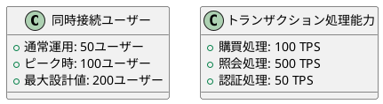
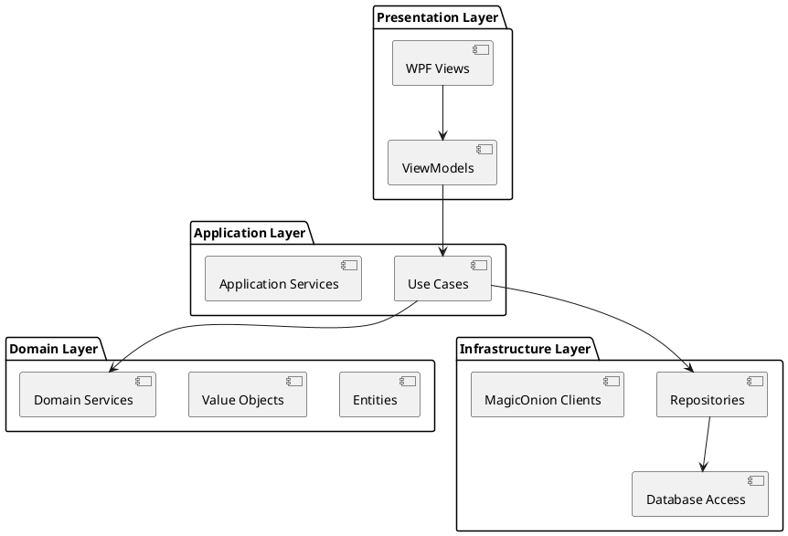

# 非機能要件 - AdventureWorks 購買管理システム

## 概要

本ドキュメントでは、AdventureWorks 購買管理システムにおける包括的な非機能要件を定義します。Clean Architecture と Domain-Driven Design を採用し、MagicOnion による RPC 分散通信と WPF による リッチクライアントアーキテクチャに適合した非機能要件を提供します。

## システムアーキテクチャ概要

### 技術スタック
- **フロントエンド**: WPF (.NET 6.0) + MVVM パターン
- **バックエンド**: ASP.NET Core + MagicOnion (gRPC ベース)
- **データベース**: SQL Server
- **認証**: JWT + REST API
- **ログ管理**: Serilog + 分散ログ収集
- **UI フレームワーク**: Kamishibai (ナビゲーション)
- **データアクセス**: Dapper (軽量 ORM)

### アーキテクチャパターン
- **Clean Architecture**: レイヤー分離による保守性確保
- **Domain-Driven Design**: ビジネスロジックの中心化
- **CQRS パターン**: コマンド・クエリ責任分離
- **Repository パターン**: データアクセス抽象化

## 1. パフォーマンス要件

### 1.1 応答時間要件

| 操作種別 | 目標応答時間 | 最大応答時間 | 条件 |
|---------|-------------|-------------|-----|
| 製品一覧表示 | ≤ 500ms | ≤ 2秒 | 1,000件以下 |
| 単一製品検索 | ≤ 200ms | ≤ 800ms | インデックス利用時 |
| 再発注処理 | ≤ 3秒 | ≤ 10秒 | 100件バッチ処理 |
| 購買履歴照会 | ≤ 1秒 | ≤ 5秒 | 6ヶ月間のデータ |
| ログイン認証 | ≤ 1秒 | ≤ 3秒 | JWT トークン生成含む |

### 1.2 スループット要件



### 1.3 リソース使用量

#### クライアント要件（WPF アプリケーション）
- **メモリ使用量**: 起動時 ≤ 100MB、最大 ≤ 500MB
- **CPU 使用率**: 平常時 ≤ 5%、処理中 ≤ 30%
- **ディスク容量**: アプリケーション ≤ 50MB

#### サーバー要件（MagicOnion サーバー）
- **メモリ使用量**: ≤ 2GB (100 同時接続時)
- **CPU 使用率**: 平常時 ≤ 20%、ピーク時 ≤ 70%
- **ネットワーク帯域**: ≤ 100Mbps

### 1.4 非同期処理とキャッシュ戦略

```csharp
// 非同期処理の実装例
public async Task<IList<RequiringPurchaseProduct>> GetRequiringPurchaseProductsAsync()
{
    var client = _clientFactory.Create<IRequiringPurchaseProductQueryService>();
    return await client.GetRequiringPurchaseProductsAsync();
}

// ログレベル別パフォーマンス設定
public record SerilogConfig(ApplicationName ApplicationName, LogEventLevel MinimumLevel, string Settings)
{
    // デバッグ時のみ詳細ログ
#if DEBUG
    .WriteTo.Debug()
#endif
}
```

## 2. セキュリティ要件

### 2.1 認証・認可

#### 認証方式
- **JWT トークンベース認証**: セッション管理の無状態化
- **従業員 ID ベース認証**: 組織内アクセス制御
- **トークンライフサイクル管理**: 適切な有効期限設定

```csharp
// 認証フィルターの実装例
public class AuthenticationFilter : IClientFilter
{
    private readonly IAuthenticationContext _authenticationContext;

    public ValueTask<ResponseContext> SendAsync(RequestContext context, Func<RequestContext, ValueTask<ResponseContext>> next)
    {
        // JWT トークンをヘッダーに設定
        context.CallOptions.Headers.Add("Authorization", $"Bearer {_authenticationContext.Token}");
        return next(context);
    }
}
```

#### 認可レベル
- **ロールベースアクセス制御**: 購買担当者、管理者の権限分離
- **リソースレベル認可**: データ単位でのアクセス制御
- **API エンドポイント保護**: すべての MagicOnion サービス保護

### 2.2 データ保護

#### 機密情報管理
**重大なセキュリティリスク**:
- データベースパスワードがハードコーディング (`Source/AdventureWorks.Business.Purchasing.SqlServer/PurchasingDatabase.cs:9`)
- 本番環境設定の露出

```csharp
// 【要改善】現在の実装
public PurchasingDatabase() : base("Purchasing", "mobPEC4a6N2Dh*") // パスワード露出
{
}
```

**推奨改善策**:
- 環境変数による設定管理
- Azure Key Vault や AWS Secrets Manager 利用
- 設定ファイルの暗号化

#### 通信セキュリティ
- **gRPC over HTTPS**: MagicOnion 通信の暗号化
- **TLS 1.2 以上**: すべての通信チャネル
- **証明書検証**: クライアント・サーバー間相互認証

### 2.3 監査ログ

```csharp
// 包括的ログ収集の実装例
public class LoggingFilterAttribute : MagicOnionFilterAttribute
{
    public override ValueTask Invoke(ServiceContext context, Func<ServiceContext, ValueTask> next)
    {
        _logger.LogInformation(
            "Method:{Method} Peer:{Peer} EmployeeId:{EmployeeId}",
            context.CallContext.Method,
            context.CallContext.Peer,
            _authenticationContext.CurrentUser.EmployeeId);

        try {
            return next(context);
        }
        catch (Exception e) {
            _logger.LogError(e, "Service call failed");
            throw;
        }
    }
}
```

#### ログ収集項目
- **認証イベント**: ログイン、ログアウト、権限変更
- **業務操作**: 購買処理、データ変更、照会履歴
- **システムイベント**: エラー、例外、パフォーマンス メトリクス
- **セキュリティイベント**: 不正アクセス試行、権限違反

## 3. 可用性・信頼性要件

### 3.1 可用性目標

| サービスレベル | 目標稼働率 | 年間ダウンタイム | 適用範囲 |
|-------------|----------|-------------|---------|
| 高可用性 | 99.5% | ≤ 44時間 | 業務時間 (8:00-18:00) |
| 標準可用性 | 99.0% | ≤ 88時間 | 業務時間外・休日 |
| 計画停止 | 月次4時間 | 年間48時間 | メンテナンス時間 |

### 3.2 障害対策

#### エラーハンドリング戦略
```csharp
// グローバル例外ハンドリング
public class LoggingAspect : Aspect
{
    public override async ValueTask InvokeAsync<T>(T next) where T : IAspectInvoke
    {
        try
        {
            await next.InvokeAsync();
        }
        catch (Exception ex)
        {
            // 構造化ログ出力
            _logger.LogError(ex, "Unhandled exception occurred");

            // ユーザーフレンドリーなエラー表示
            await _messageService.ShowErrorAsync("システムエラーが発生しました。");

            throw;
        }
    }
}
```

#### 冗長化設計
- **データベース**: SQL Server Always On 可用性グループ
- **アプリケーション**: 複数サーバーでの負荷分散
- **ネットワーク**: 冗長化された通信経路

### 3.3 データ整合性

#### トランザクション管理
- **ACID 特性の保証**: データベーストランザクション
- **分散トランザクション**: 複数サービス間の整合性
- **楽観的同時実行制御**: バージョン管理による競合回避

#### バックアップ・復旧
- **データベースバックアップ**: 日次フルバックアップ + 15分間隔ログバックアップ
- **RTO (Recovery Time Objective)**: ≤ 4時間
- **RPO (Recovery Point Objective)**: ≤ 15分

## 4. ユーザビリティ要件

### 4.1 使いやすさの指標

#### WPF UI デザイン原則
- **Material Design**: モダンで直感的な UI
- **レスポンシブレイアウト**: 画面サイズ対応
- **アクセシビリティ**: WCAG 2.1 AA レベル準拠

```xml
<!-- XAML でのユーザビリティ向上例 -->
<Button Style="{StaticResource MaterialDesignRaisedButton}"
        ToolTip="要再発注製品一覧を表示します"
        AutomationProperties.Name="再発注処理"
        IsEnabled="{Binding CanExecuteRePurchasing}">
    再発注処理
</Button>
```

#### Kamishibai ナビゲーション
- **直感的画面遷移**: 戻る・進むナビゲーション
- **コンテキスト保持**: 操作状態の維持
- **画面間データ連携**: ViewModels 間のデータ受け渡し

### 4.2 操作性要件

#### キーボードショートカット
- **Ctrl+N**: 新規作成
- **Ctrl+S**: 保存
- **F5**: 最新情報に更新
- **Escape**: キャンセル

#### 入力支援機能
- **オートコンプリート**: 製品名、仕入先名
- **入力値検証**: リアルタイムバリデーション
- **エラーメッセージ**: 分かりやすい日本語表示

### 4.3 学習効率

- **操作習得時間**: 新規ユーザー ≤ 2時間
- **ヘルプシステム**: コンテキスト依存ヘルプ
- **エラー回復**: ≤ 30秒でエラー状態からの復旧

## 5. 拡張性・保守性要件

### 5.1 アーキテクチャ拡張性

#### Clean Architecture の利点


#### 技術的拡張性
- **マイクロサービス対応**: MagicOnion サービス分割
- **新技術導入**: .NET の最新バージョン対応
- **クラウド移行**: Azure/AWS 対応アーキテクチャ

### 5.2 コード品質

#### 開発標準
- **C# 10.0 の最新機能**: Record types, Pattern matching
- **Nullable Reference Types**: null 安全性の向上
- **ImplicitUsings**: 冗長な using ステートメント削減

```csharp
// Directory.Build.props での品質設定
<PropertyGroup>
    <LangVersion>latest</LangVersion>
    <ImplicitUsings>enable</ImplicitUsings>
    <Nullable>enable</Nullable>
</PropertyGroup>
```

#### テスタビリティ
- **依存性注入**: DI コンテナによる疎結合
- **インターフェース分離**: Mock 可能な設計
- **単体テスト**: NUnit + FluentAssertions

### 5.3 運用保守性

#### ログ管理
- **構造化ログ**: Serilog による JSON 形式
- **分散ログ収集**: MagicOnion 経由での集約
- **ログレベル動的変更**: 運用中のログレベル調整

```csharp
// 設定可能なログ構成
public record SerilogConfig(ApplicationName ApplicationName, LogEventLevel MinimumLevel, string Settings)
{
    public ILogger Build()
    {
        var settingString = Settings
            .Replace("%MinimumLevel%", MinimumLevel.ToString())
            .Replace("%ApplicationName%", ApplicationName.Value);
        // ... ログ設定構築
    }
}
```

#### 監視・診断
- **アプリケーション メトリクス**: パフォーマンス カウンター
- **ヘルスチェック**: システム正常性監視
- **分散トレーシング**: リクエスト追跡

## 6. 運用要件

### 6.1 デプロイメント

#### 継続的デプロイメント
- **ブルーグリーンデプロイ**: ゼロダウンタイム更新
- **自動ロールバック**: 異常検知時の自動復旧
- **段階的ロールアウト**: 段階的な本番反映

#### 環境管理
- **開発環境**: 開発者個別環境
- **テスト環境**: 統合テスト用環境
- **ステージング環境**: 本番同等環境
- **本番環境**: 可用性重視設定

### 6.2 監視・運用

#### 監視項目
- **インフラメトリクス**: CPU、メモリ、ディスク、ネットワーク
- **アプリケーションメトリクス**: 応答時間、エラー率、スループット
- **ビジネスメトリクス**: 購買件数、ユーザー数、機能利用率

#### アラート設定
- **Critical**: システム停止、データ破損
- **Warning**: パフォーマンス低下、リソース不足
- **Info**: 予防保守、使用量通知

## 7. コンプライアンス要件

### 7.1 データ保護規制
- **個人情報保護法**: 従業員情報の適切な管理
- **企業内規程**: データ取扱いガイドライン準拠
- **アクセス ログ保持**: 7年間の操作履歴保管

### 7.2 監査要件
- **操作証跡**: すべての業務操作記録
- **変更履歴**: データ変更の追跡可能性
- **定期監査**: 四半期ごとのセキュリティ監査

## まとめ

本非機能要件により、以下の品質特性を実現します：

1. **パフォーマンス**: 高速な応答時間とスケーラビリティ
2. **セキュリティ**: 堅牢な認証・認可とデータ保護
3. **可用性**: 高い稼働率と障害耐性
4. **ユーザビリティ**: 直感的で使いやすい WPF UI
5. **拡張性**: Clean Architecture による柔軟な機能拡張
6. **保守性**: 構造化されたコードと包括的なログ管理

継続的な監視と改善により、これらの要件を維持し、システムの価値を最大化していきます。