# 運用要件定義 - AdventureWorks 購買管理システム

## 概要

本ドキュメントでは、AdventureWorks 購買管理システムの運用に関する要件を定義します。Clean Architecture と Domain-Driven Design を採用したクライアント・サーバー型システムの運用特性を考慮した包括的な運用要件を提供します。

## システム運用アーキテクチャ

### システム構成概要

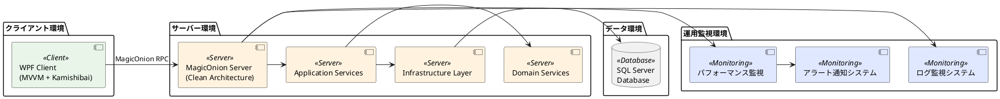

### 運用環境構成

| 環境種別 | 目的 | 構成 | データ同期 |
|---------|------|-----|----------|
| 開発環境 | 開発・単体テスト | 1台構成 | 開発用テストデータ |
| テスト環境 | 統合テスト・受入テスト | 2台構成 | 本番相当データ（マスキング済み） |
| ステージング環境 | 本番前検証 | 本番同等構成 | 本番データのコピー（マスキング済み） |
| 本番環境 | サービス提供 | 冗長構成 | リアルタイムデータ |

## インフラストラクチャ運用要件

### サーバー要件

#### アプリケーションサーバー

**最小要件**:
- CPU: 4コア以上
- メモリ: 8GB以上
- ストレージ: 100GB以上（SSD推奨）
- OS: Windows Server 2019 以上または Linux（.NET Core対応）

**推奨要件**:
- CPU: 8コア以上
- メモリ: 16GB以上
- ストレージ: 500GB以上（NVMe SSD）
- 冗長化: 最低2台構成（ロードバランサー使用）

#### データベースサーバー

**最小要件**:
- CPU: 8コア以上
- メモリ: 16GB以上
- ストレージ: 500GB以上（SSD RAID1構成）
- SQL Server 2019 Standard Edition 以上

**推奨要件**:
- CPU: 16コア以上
- メモリ: 32GB以上
- ストレージ: 1TB以上（SSD RAID10構成）
- SQL Server 2019 Enterprise Edition
- Always On 可用性グループ構成

### クライアント要件

#### ハードウェア要件

- CPU: Intel Core i5 以上または AMD Ryzen 5 以上
- メモリ: 8GB以上
- ストレージ: 50GB以上の空き容量
- 画面解像度: 1920×1080以上
- ネットワーク: 有線LAN推奨（最低10Mbps）

#### ソフトウェア要件

- OS: Windows 10 Pro 以上（最新アップデート適用）
- .NET Framework 4.8 以上
- Microsoft Visual C++ 2019 Redistributable
- Windows Defender または企業向けアンチウイルスソフト

### ネットワーク要件

#### 通信要件

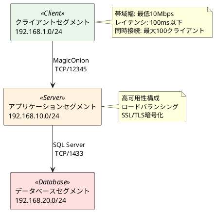

#### ファイアウォール設定

| 通信方向 | プロトコル | ポート | 用途 |
|---------|-----------|-------|------|
| Client → App | TCP | 12345 | MagicOnion RPC |
| App → DB | TCP | 1433 | SQL Server |
| Monitoring → App | TCP | 80/443 | ヘルスチェック |
| Admin → All | TCP | 3389 | リモートデスクトップ |

## デプロイ・配置運用

### デプロイ戦略

#### ブルーグリーンデプロイ

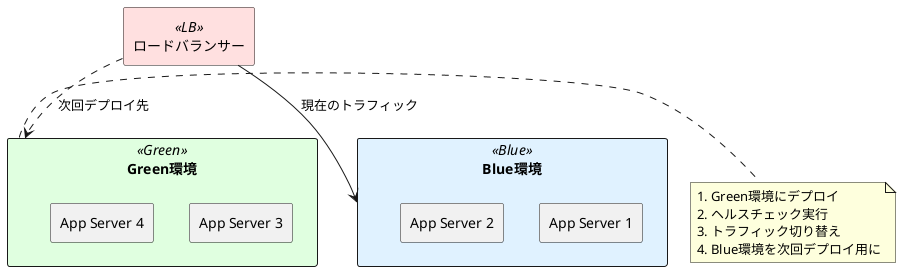

#### デプロイフロー

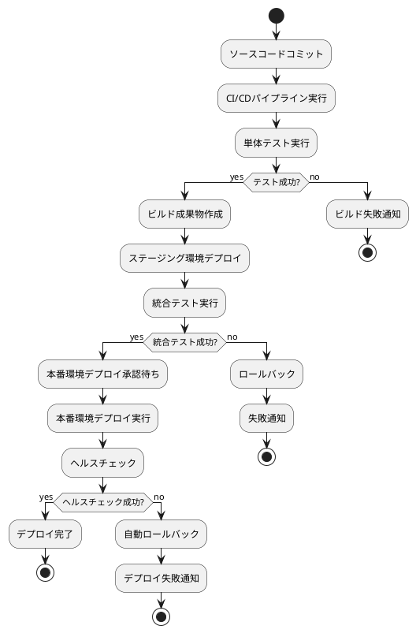

### クライアントデプロイ

#### ClickOnce配布

```csharp
// 自動更新機能の実装例
public class ApplicationUpdater
{
    public async Task CheckForUpdatesAsync()
    {
        if (ApplicationDeployment.IsNetworkDeployed)
        {
            var deployment = ApplicationDeployment.CurrentDeployment;
            var updateInfo = await deployment.CheckForDetailedUpdateAsync();

            if (updateInfo.UpdateAvailable)
            {
                // ユーザーに更新通知
                var result = MessageBox.Show(
                    "新しいバージョンが利用可能です。更新しますか？",
                    "アップデート通知",
                    MessageBoxButton.YesNo);

                if (result == MessageBoxResult.Yes)
                {
                    deployment.UpdateAsync();
                }
            }
        }
    }
}
```

## 監視・運用

### システム監視要件

#### パフォーマンス監視

**サーバーサイド監視項目**:
- CPU使用率: 80%未満を維持
- メモリ使用率: 75%未満を維持
- ディスクI/O: IOPS監視とレスポンス時間
- ネットワーク帯域: 使用率と接続数
- MagicOnion RPC応答時間: 平均500ms以下

**データベース監視項目**:
- クエリ実行時間: 長時間実行クエリの検出
- ロック待機: デッドロックの監視
- インデックス効率: クエリプランの監視
- 接続プール: アクティブ接続数の監視

**クライアント監視項目**:
- メモリリーク: ガベージコレクション監視
- UI応答性: フレームレート監視
- ネットワーク接続: 切断・再接続の監視

#### 監視ダッシュボード

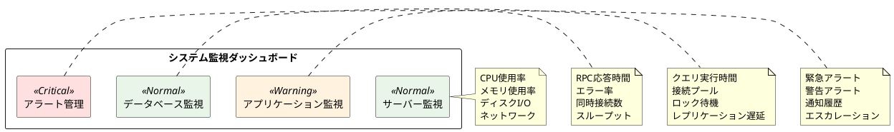

### ログ管理

#### ログレベル定義

| レベル | 用途 | 出力条件 | 保存期間 |
|--------|------|---------|---------|
| FATAL | システム停止レベルのエラー | 常時 | 永続保存 |
| ERROR | アプリケーションエラー | 常時 | 1年間 |
| WARN | 警告事象 | 常時 | 6ヶ月間 |
| INFO | 業務処理の開始・終了 | 常時 | 3ヶ月間 |
| DEBUG | デバッグ情報 | 開発・テスト環境のみ | 1ヶ月間 |

#### ログ出力実装例

```csharp
// Domain層でのログ出力例
public class PurchaseOrderDomainService
{
    private readonly ILogger<PurchaseOrderDomainService> _logger;

    public async Task<PurchaseOrder> CreatePurchaseOrderAsync(
        IEnumerable<RequiringPurchaseProduct> requiringProducts)
    {
        _logger.LogInformation("発注書作成開始. 対象商品数: {ProductCount}",
            requiringProducts.Count());

        try
        {
            var purchaseOrder = new PurchaseOrder(/* parameters */);

            _logger.LogInformation("発注書作成完了. 発注書ID: {PurchaseOrderId}",
                purchaseOrder.Id.Value);

            return purchaseOrder;
        }
        catch (DomainException ex)
        {
            _logger.LogError(ex, "発注書作成でドメインエラーが発生: {ErrorMessage}",
                ex.Message);
            throw;
        }
        catch (Exception ex)
        {
            _logger.LogFatal(ex, "発注書作成で予期しないエラーが発生");
            throw;
        }
    }
}
```

### アラート運用

#### アラート設定

**緊急アラート（即座対応）**:
- システムダウン
- データベース接続エラー
- メモリ使用率95%以上
- 応答時間5秒以上

**警告アラート（24時間以内対応）**:
- CPU使用率80%以上継続
- エラー率5%以上
- ディスク使用率85%以上
- 同時接続数上限の80%到達

**通知アラート（定期確認）**:
- バッチ処理の完了通知
- バックアップ完了通知
- 定期メンテナンス通知

## バックアップ・リストア運用

### バックアップ戦略

#### データベースバックアップ

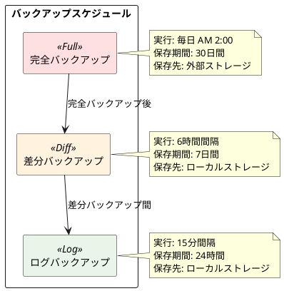

#### バックアップ検証

```sql
-- バックアップ整合性チェック用クエリ
RESTORE VERIFYONLY
FROM DISK = 'C:\Backup\AdventureWorksPurchasing_Full.bak'
WITH CHECKSUM;

-- データ整合性チェック
DBCC CHECKDB('AdventureWorksPurchasing')
WITH NO_INFOMSGS, ALL_ERRORMSGS;
```

### 災害復旧（DR）

#### RTO/RPO設定

| 障害レベル | RTO（目標復旧時間） | RPO（目標復旧時点） | 復旧方法 |
|----------|-------------------|-------------------|---------|
| アプリケーション障害 | 30分以内 | 0分 | 自動再起動・切り替え |
| サーバー障害 | 2時間以内 | 15分以内 | 冗長サーバーへの切り替え |
| データベース障害 | 4時間以内 | 1時間以内 | Always Onフェイルオーバー |
| サイト全体障害 | 24時間以内 | 4時間以内 | DRサイトでの復旧 |

#### 復旧手順

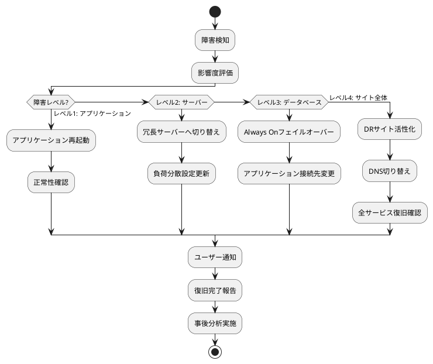

## セキュリティ運用

### アクセス制御

#### 認証・認可モデル

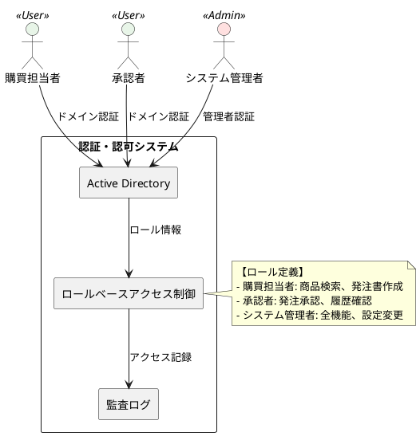

#### セキュリティ監視

```csharp
// セキュリティ監査ログの実装例
public class SecurityAuditService
{
    private readonly ILogger<SecurityAuditService> _logger;

    public void LogUserAccess(string userId, string action, string resource)
    {
        _logger.LogInformation(
            "ユーザーアクセス: UserId={UserId}, Action={Action}, Resource={Resource}, Timestamp={Timestamp}",
            userId, action, resource, DateTime.UtcNow);
    }

    public void LogSecurityEvent(SecurityEventType eventType, string details)
    {
        _logger.LogWarning(
            "セキュリティイベント: EventType={EventType}, Details={Details}, Timestamp={Timestamp}",
            eventType, details, DateTime.UtcNow);
    }
}
```

### 脆弱性管理

#### 定期セキュリティ対応

| 対応項目 | 頻度 | 責任者 | 成果物 |
|---------|------|-------|-------|
| セキュリティパッチ適用 | 月次 | システム管理者 | パッチ適用報告書 |
| 脆弱性スキャン | 四半期 | セキュリティ担当 | 脆弱性評価報告書 |
| ペネトレーションテスト | 年次 | 外部業者 | セキュリティ監査報告書 |
| セキュリティ教育 | 半期 | 全従業員 | 教育受講証明書 |

## 保守・メンテナンス運用

### 定期メンテナンス

#### メンテナンススケジュール

```plantuml
@startuml
gantt
    title システム定期メンテナンススケジュール
    dateFormat  YYYY-MM-DD
    section 月次メンテナンス
    データベース統計更新        :done, monthly1, 2024-01-15, 2h
    インデックス再構築          :done, monthly2, after monthly1, 3h
    ログファイルクリーンアップ   :done, monthly3, after monthly2, 1h

    section 四半期メンテナンス
    システム全体バックアップ    :quarterly1, 2024-03-15, 6h
    パフォーマンス分析         :quarterly2, after quarterly1, 4h
    容量計画レビュー           :quarterly3, after quarterly2, 2h

    section 年次メンテナンス
    システム全体検査          :yearly1, 2024-12-15, 24h
    DR環境動作確認           :yearly2, after yearly1, 8h
@enduml
```

#### メンテナンス実行手順

```powershell
# データベースメンテナンススクリプト例
# インデックス再構築
$SqlInstance = "PROD-DB-01"
$Database = "AdventureWorksPurchasing"

# 統計情報更新
Invoke-Sqlcmd -ServerInstance $SqlInstance -Database $Database -Query @"
UPDATE STATISTICS Product WITH FULLSCAN;
UPDATE STATISTICS Vendor WITH FULLSCAN;
UPDATE STATISTICS PurchaseOrder WITH FULLSCAN;
"@

# インデックス再構築
Invoke-Sqlcmd -ServerInstance $SqlInstance -Database $Database -Query @"
ALTER INDEX ALL ON Product REBUILD WITH (ONLINE = ON);
ALTER INDEX ALL ON Vendor REBUILD WITH (ONLINE = ON);
ALTER INDEX ALL ON PurchaseOrder REBUILD WITH (ONLINE = ON);
"@

# ログファイルクリーンアップ
Get-ChildItem "C:\Logs\AdventureWorksPurchasing\" -Name "*.log" |
Where-Object {$_.LastWriteTime -lt (Get-Date).AddDays(-30)} |
Remove-Item -Force
```

### 容量計画

#### リソース使用量予測

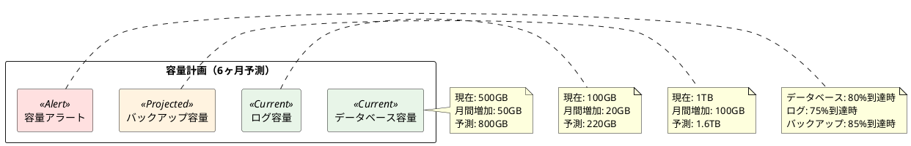

## 運用プロセス・手順

### インシデント管理

#### インシデント分類・優先度

| 優先度 | 影響範囲 | 対応時間 | エスカレーション | 例 |
|--------|---------|---------|----------------|---|
| P1（緊急） | 全システム停止 | 即座 | 30分以内に管理者 | システム全体ダウン |
| P2（高） | 一部機能停止 | 2時間以内 | 4時間以内に管理者 | 発注機能エラー |
| P3（中） | パフォーマンス劣化 | 8時間以内 | 24時間以内に管理者 | 応答時間遅延 |
| P4（低） | 軽微な不具合 | 72時間以内 | 1週間以内に担当者 | 画面表示崩れ |

#### インシデント対応フロー

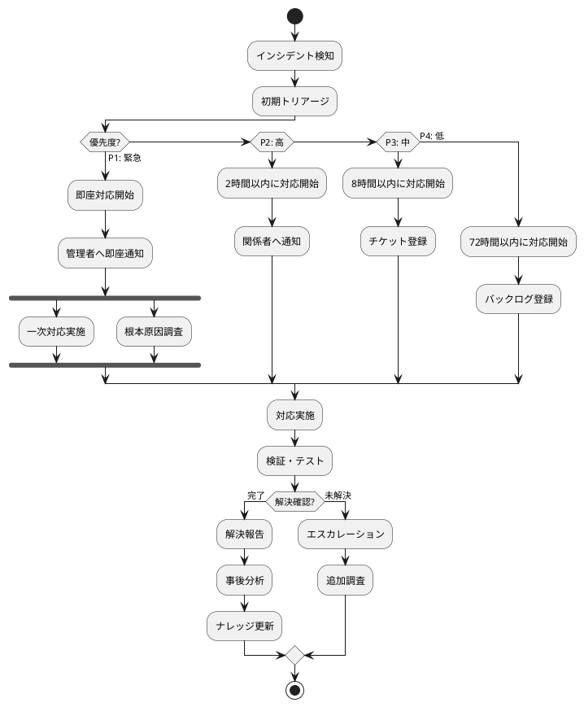

### 変更管理

#### 変更要求プロセス

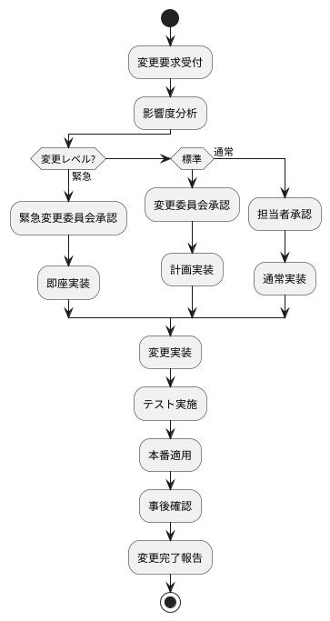

### パフォーマンス管理

#### 性能ベースライン

| 項目 | ベースライン値 | 警告閾値 | 重要閾値 | 測定方法 |
|------|---------------|---------|---------|---------|
| レスポンス時間（商品検索） | 200ms | 500ms | 1000ms | APM監視 |
| レスポンス時間（発注書作成） | 300ms | 800ms | 1500ms | APM監視 |
| スループット | 100 TPS | 80 TPS | 60 TPS | ロードバランサー監視 |
| 同時接続数 | 50ユーザー | 80ユーザー | 100ユーザー | アプリケーション監視 |
| データベース応答時間 | 50ms | 200ms | 500ms | SQL Server監視 |

## SLA・可用性要件

### サービスレベル目標

#### 可用性目標

| サービス | 稼働率目標 | 月間許容停止時間 | 測定方法 |
|---------|-----------|----------------|---------|
| システム全体 | 99.5% | 3.6時間 | 外形監視 |
| MagicOnion API | 99.8% | 1.4時間 | ヘルスチェック |
| データベース | 99.9% | 43分 | 接続監視 |
| クライアント機能 | 99.0% | 7.2時間 | ユーザー報告 |

#### パフォーマンス目標

| 指標 | 目標値 | 測定条件 | 報告頻度 |
|------|-------|---------|---------|
| 平均レスポンス時間 | 500ms以下 | 通常業務時間 | 日次 |
| 95パーセンタイルレスポンス時間 | 1秒以下 | 通常業務時間 | 日次 |
| エラー率 | 1%以下 | 全時間 | リアルタイム |
| スループット | 最低80 TPS | ピーク時間 | 時間次 |

### SLA違反時の対応

#### エスカレーション手順

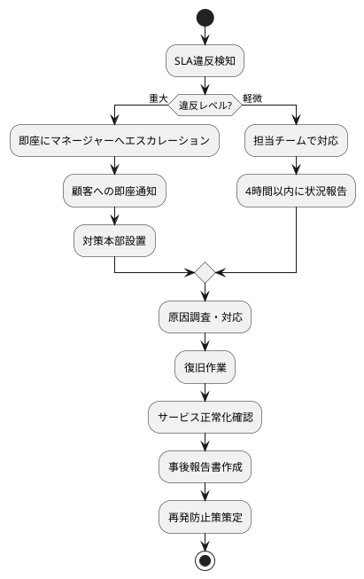

## 運用コスト管理

### コスト要素

#### インフラストラクチャコスト

| 項目 | 月額概算 | 年額概算 | 備考 |
|------|---------|---------|------|
| サーバーハードウェア | ¥300,000 | ¥3,600,000 | 減価償却含む |
| ソフトウェアライセンス | ¥200,000 | ¥2,400,000 | SQL Server, Windows Server |
| ネットワーク・通信費 | ¥50,000 | ¥600,000 | 専用線・インターネット |
| 電力・設備費 | ¥100,000 | ¥1,200,000 | データセンター費用 |
| **合計** | **¥650,000** | **¥7,800,000** |  |

#### 運用要員コスト

| 役割 | 人数 | 月額単価 | 月額合計 | 年額合計 |
|------|------|---------|---------|---------|
| システム管理者 | 2名 | ¥600,000 | ¥1,200,000 | ¥14,400,000 |
| 運用監視担当 | 3名 | ¥450,000 | ¥1,350,000 | ¥16,200,000 |
| ヘルプデスク | 2名 | ¥350,000 | ¥700,000 | ¥8,400,000 |
| **合計** | **7名** |  | **¥3,250,000** | **¥39,000,000** |

### 運用効率化

#### 自動化による効率改善

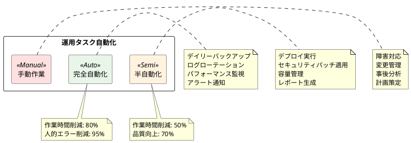

## 教育・トレーニング

### 運用要員のスキル要件

#### 必須スキル

**システム管理者**:
- Windows Server管理（中級以上）
- SQL Server管理（中級以上）
- PowerShell スクリプティング
- ネットワーク基礎知識
- セキュリティ基礎知識

**運用監視担当**:
- システム監視ツール操作
- ログ分析スキル
- 基本的なトラブルシューティング
- インシデント管理プロセス理解

#### 継続教育計画

| 対象者 | 教育内容 | 頻度 | 目的 |
|-------|---------|------|------|
| 全運用要員 | セキュリティ基礎 | 半年毎 | セキュリティ意識向上 |
| システム管理者 | 新技術動向 | 四半期毎 | 技術レベル維持 |
| 運用監視担当 | 監視ツール操作 | 年1回 | 運用品質向上 |
| ヘルプデスク | 接客・対応スキル | 年2回 | サービス品質向上 |

### ドキュメント管理

#### 運用ドキュメント体系

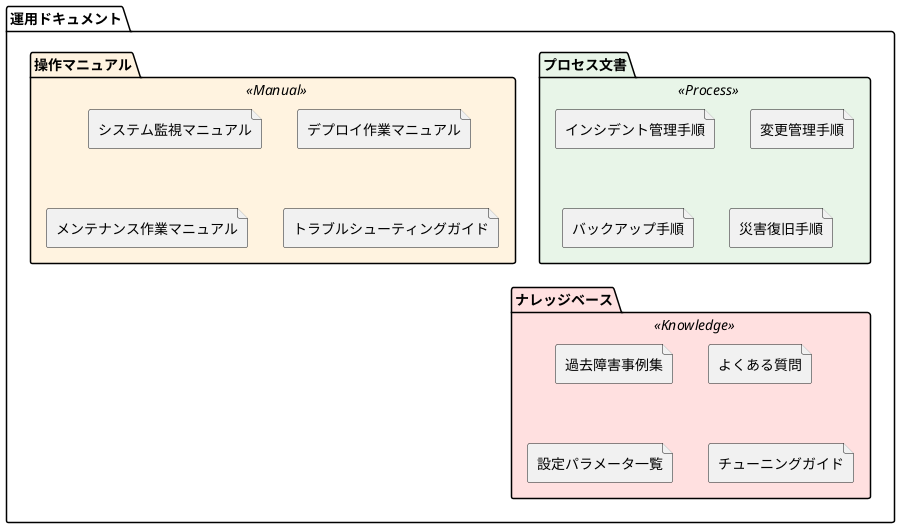

## まとめ

本運用要件定義書は、AdventureWorks 購買管理システムの安定運用を実現するための包括的な要件を定義しました。

### 重要なポイント

1. **高可用性の実現**: 99.5%の稼働率目標と適切な冗長化構成
2. **セキュリティの確保**: 多層防御とアクセス制御の徹底
3. **運用効率化**: 自動化推進による人的エラーの削減
4. **コスト最適化**: 適切なリソース配分と効率的な運用体制
5. **継続的改善**: 監視・分析に基づく改善サイクル

これらの要件を満たすことで、ビジネス要求に応える安定したシステム運用を実現し、「変更を楽に安全にできて役に立つソフトウェア」としての価値を継続的に提供します。