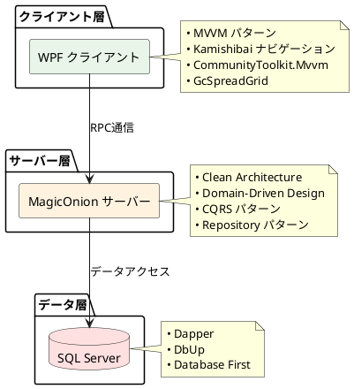
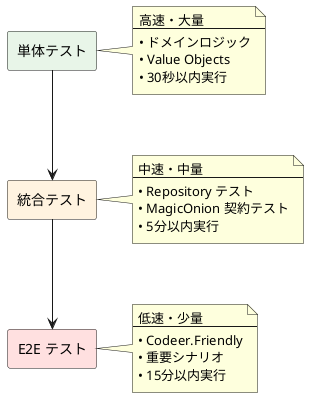

# 技術スタック一覧 - AdventureWorks 購買管理システム

## 概要

本ドキュメントでは、AdventureWorks 購買管理システムで採用している技術スタックを体系的に整理し、各技術の採用理由と役割を明確にします。

## システムアーキテクチャ概要

## 技術スタック詳細

### フロントエンド（WPF クライアント）

| カテゴリ | 技術 | バージョン | 役割・用途 | 採用理由 |
|---------|------|----------|-----------|-----------|
| **UI フレームワーク** | WPF | .NET 8.0 | デスクトップ UI | リッチなデスクトップアプリケーション構築 |
| **アーキテクチャパターン** | MVVM | - | UI とビジネスロジックの分離 | テスタビリティとメンテナビリティ向上 |
| **MVVM ライブラリ** | CommunityToolkit.Mvvm | 8.x | MVVM パターンの実装支援 | 標準的で軽量な MVVM 実装 |
| **ナビゲーション** | Kamishibai | 3.x | 画面遷移管理 | MVVM に適したナビゲーション機能 |
| **データ表示** | GcSpreadGrid | - | 高機能データグリッド | Excel ライクな操作性 |
| **依存性注入** | Microsoft.Extensions.DI | 8.x | DI コンテナ | 疎結合とテスタビリティ |
| **ログ** | Serilog | 3.x | 構造化ログ | 高機能なログ出力 |
| **デプロイメント** | ClickOnce | - | アプリケーション配布 | 自動更新機能 |

### バックエンド（MagicOnion サーバー）

| カテゴリ | 技術 | バージョン | 役割・用途 | 採用理由 |
|---------|------|----------|-----------|-----------|
| **RPC フレームワーク** | MagicOnion | 5.x | クライアント・サーバー間通信 | 型安全な RPC 通信 |
| **アーキテクチャ** | Clean Architecture | - | レイヤー分離アーキテクチャ | 保守性と拡張性の確保 |
| **ドメイン設計** | Domain-Driven Design | - | ビジネスロジック中心設計 | ドメイン知識の表現力向上 |
| **パターン** | CQRS | - | コマンドとクエリの分離 | 読み取り・更新の最適化 |
| **パターン** | Repository | - | データアクセス抽象化 | データアクセス層の疎結合 |
| **パターン** | Unit of Work | - | トランザクション管理 | データ整合性の確保 |
| **ランタイム** | .NET 8.0 | 8.x | アプリケーション実行環境 | 高性能と最新機能 |
| **ログ** | Serilog | 3.x | 構造化ログ | 高機能なログ出力 |

### データベース

| カテゴリ | 技術 | バージョン | 役割・用途 | 採用理由 |
|---------|------|----------|-----------|-----------|
| **データベース** | SQL Server | 2019/2022 | データ永続化 | エンタープライズ向け RDBMS |
| **ORM** | Dapper | 2.x | O/R マッピング | 軽量で高性能な Micro ORM |
| **マイグレーション** | DbUp | 5.x | スキーマ管理 | データベース変更の管理 |
| **設計アプローチ** | Database First | - | データベースからのモデル生成 | SQL 中心のアプローチ |

### テスティング

| カテゴリ | 技術 | バージョン | 役割・用途 | 採用理由 |
|---------|------|----------|-----------|-----------|
| **テストフレームワーク** | NUnit | 3.13.x | 単体・統合テスト | .NET 標準テストフレームワーク |
| **アサーション** | FluentAssertions | 6.x | 読みやすいアサーション | テストコードの可読性向上 |
| **モック** | Moq | 4.x | モッキング | 依存関係の分離 |
| **UI テスト** | Codeer.Friendly | - | WPF UI 自動化 | Page Object Pattern |
| **テストデータ** | Bogus | - | テストデータ生成 | リアルなテストデータ作成 |
| **テストコンテナ** | Testcontainers | - | テスト環境構築 | 隔離されたテスト環境 |
| **TDD アプローチ** | Test-Driven Development | - | テスト駆動開発 | 品質とリファクタビリティ |

### 開発ツール・CI/CD

| カテゴリ | 技術 | バージョン | 役割・用途 | 採用理由 |
|---------|------|----------|-----------|-----------|
| **IDE** | JetBrains Rider | 2024.x | 統合開発環境 | 高機能な .NET IDE |
| **バージョン管理** | Git | - | ソースコード管理 | 分散バージョン管理 |
| **文書化** | PlantUML | - | 図表作成 | テキストベース図表生成 |
| **文書化** | MkDocs | - | ドキュメントサイト | 静的サイト生成 |
| **コンテナ** | Docker | - | 開発環境構築 | 環境統一 |
| **オーケストレーション** | Docker Compose | - | 複数コンテナ管理 | 開発環境の簡素化 |

### ドメイン固有技術

| カテゴリ | 技術パターン | 役割・用途 | 実装例 |
|---------|--------------|-----------|--------|
| **Value Objects** | 不変オブジェクト | ドメイン概念の表現 | `Dollar`, `ProductId`, `AccountNumber` |
| **Entities** | 識別子を持つオブジェクト | ビジネスエンティティ | `Product`, `Vendor`, `PurchaseOrder` |
| **Aggregates** | 集約ルート | トランザクション境界 | `PurchaseOrder` 集約 |
| **Domain Services** | ドメインサービス | 複雑なビジネスルール | 再発注ロジック |
| **Specifications** | 仕様パターン | 複雑な条件式 | 発注要求条件 |

## アーキテクチャ決定記録（ADR）

### ADR-001: MagicOnion 採用決定

**背景**: クライアント・サーバー間の通信方式選択

**決定**: MagicOnion を採用

**理由**:
- 型安全な RPC 通信
- gRPC ベースの高性能通信
- .NET エコシステムとの親和性
- インターフェース駆動開発

### ADR-002: Clean Architecture 採用決定

**背景**: サーバーサイドアーキテクチャ選択

**決定**: Clean Architecture を採用

**理由**:
- 依存関係の逆転による疎結合
- テスタビリティの向上
- ビジネスロジックの独立性
- 長期保守性の確保

### ADR-003: Domain-Driven Design 採用決定

**背景**: ドメインモデリング手法選択

**決定**: Domain-Driven Design を採用

**理由**:
- ドメイン知識の明示的表現
- Value Objects による型安全性
- Aggregates による整合性境界
- ユビキタス言語の確立

### ADR-004: MVVM パターン採用決定

**背景**: WPF UI アーキテクチャ選択

**決定**: MVVM パターンを採用

**理由**:
- UI とビジネスロジックの分離
- データバインディング活用
- テスタビリティの向上
- WPF のベストプラクティス

## テスト戦略

### テストピラミッド

### カバレッジ目標

| レイヤー | 目標カバレッジ | テスト種別 |
|---------|-------------|-----------|
| Domain | 95%以上 | 単体テスト |
| Application | 85%以上 | 統合テスト |
| Infrastructure | 70%以上 | 統合テスト |
| Presentation | シナリオ100% | E2E テスト |

## 品質保証

### 静的解析

- **コード品質**: SonarQube
- **セキュリティ**: セキュリティアナライザー
- **パフォーマンス**: BenchmarkDotNet

### CI/CD パイプライン

1. **ビルド**: .NET SDK によるビルド
2. **テスト**: 単体・統合・E2E テストの実行
3. **品質ゲート**: カバレッジとメトリクス確認
4. **デプロイ**: ClickOnce パッケージ作成

## 運用・監視

### ログ戦略

- **構造化ログ**: Serilog による JSON 形式ログ
- **ログレベル**: Debug, Information, Warning, Error, Fatal
- **ログ出力先**: ファイル、データベース、外部サービス

### 監視項目

- **パフォーマンス**: 応答時間、スループット
- **可用性**: サービス稼働率
- **エラー**: 例外発生率、エラーログ
- **リソース**: CPU、メモリ、ディスク使用量

## まとめ

本技術スタックは以下の原則に基づいて選定されています：

1. **保守性**: Clean Architecture による明確な責任分離
2. **拡張性**: DDD による柔軟なドメインモデル
3. **品質**: TDD による包括的テストカバレッジ
4. **パフォーマンス**: MagicOnion による高速通信
5. **開発効率**: 型安全性と IDE サポート

これらの技術選択により、変更を楽に安全に行える、長期間にわたって価値を提供し続ける質の高いソフトウェアの構築を実現しています。