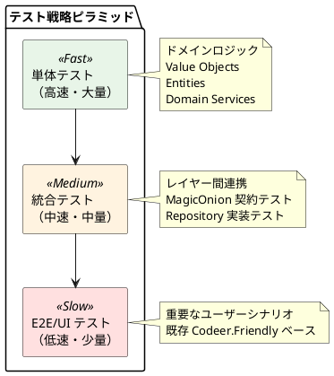

# テスト戦略 - AdventureWorks 購買管理システム

## 概要

本ドキュメントでは、AdventureWorks 購買管理システムにおける包括的なテスト戦略を定義します。Clean Architecture と Domain-Driven Design を採用したアーキテクチャに適した、効率的かつ品質の高いテスト戦略を提供します。

## 現状分析

### 既存テスト構成
- **テストフレームワーク**: NUnit 3.13.3
- **アサーションライブラリ**: FluentAssertions
- **UI テストツール**: Codeer.Friendly (WPF 自動化)
- **既存テスト範囲**: E2E シナリオテスト（再発注ユースケース）
- **テストアーキテクチャ**: Page Object Pattern によるドライバー抽象化

### システムアーキテクチャ特性
1. **Clean Architecture** による明確なレイヤー分離
2. **Domain-Driven Design** による豊富なドメインモデル
3. **MagicOnion** による RPC 分散通信
4. **WPF + MVVM** によるリッチクライアント
5. **Value Objects** と **Entities** による型安全性

## テスト戦略

### 基本方針

**ハイブリッド型テストピラミッド** を採用し、各アーキテクチャレイヤーの特性に応じた最適なテスト手法を適用します。



### レイヤー別テスト戦略

#### 1. ドメインレイヤー（高速・高頻度）

**対象**:
- Value Objects（AccountNumber, ProductId, Dollar 等）
- Entities（Product, Vendor, PurchaseOrder 等）
- Domain Services
- Aggregates

**テスト手法**:
```csharp
// Value Object テストの例
[TestFixture]
public class AccountNumberTest
{
    [Test]
    public void 正常な値で作成できる()
    {
        var accountNumber = AccountNumber.From("VENDOR001");
        accountNumber.Value.Should().Be("VENDOR001");
    }

    [Test]
    public void 不正な値では例外が発生する()
    {
        Action act = () => AccountNumber.From("");
        act.Should().Throw<ArgumentException>();
    }

    [Test]
    public void 同じ値のオブジェクトは等価である()
    {
        var acc1 = AccountNumber.From("VENDOR001");
        var acc2 = AccountNumber.From("VENDOR001");
        acc1.Should().Be(acc2);
    }
}
```

**品質基準**:
- カバレッジ: 95%以上
- 実行速度: 1ms未満/テスト
- TDD で開発

#### 2. アプリケーションレイヤー（中速・中頻度）

**対象**:
- Use Cases
- Application Services
- Repository インターフェース
- Query Services

**テスト手法**:
```csharp
// Use Case テストの例
[TestFixture]
public class RePurchasingUseCaseTest
{
    private Mock<IPurchaseOrderRepository> _mockRepo;
    private Mock<IRequiringPurchaseProductQuery> _mockQuery;
    private RePurchasingUseCase _useCase;

    [SetUp]
    public void SetUp()
    {
        _mockRepo = new Mock<IPurchaseOrderRepository>();
        _mockQuery = new Mock<IRequiringPurchaseProductQuery>();
        _useCase = new RePurchasingUseCase(_mockRepo.Object, _mockQuery.Object);
    }

    [Test]
    public void 正常に再発注が実行される()
    {
        // Arrange
        var products = CreateRequiringProducts();
        _mockQuery.Setup(q => q.GetRequiringProducts())
                  .ReturnsAsync(products);

        // Act
        var result = await _useCase.ExecuteAsync();

        // Assert
        result.Should().BeSuccessful();
        _mockRepo.Verify(r => r.CreatePurchaseOrderAsync(It.IsAny<PurchaseOrder>()));
    }
}
```

**品質基準**:
- カバレッジ: 85%以上
- 実行速度: 100ms未満/テスト
- Mock を活用した依存関係の分離

#### 3. インフラストラクチャレイヤー（中速・低頻度）

**対象**:
- Repository 実装
- MagicOnion Service 実装
- データベースアクセス
- 外部システム連携

**テスト手法**:
```csharp
// Repository 実装テストの例
[TestFixture]
public class ProductRepositoryTest
{
    private TestDatabase _database;
    private ProductRepository _repository;

    [SetUp]
    public void SetUp()
    {
        _database = TestDatabase.Create();
        _repository = new ProductRepository(_database.ConnectionString);
    }

    [Test]
    public async Task 製品を正常に取得できる()
    {
        // Arrange
        await _database.SeedProductAsync(CreateTestProduct());

        // Act
        var product = await _repository.GetByIdAsync(ProductId.From(1));

        // Assert
        product.Should().NotBeNull();
        product.Name.Should().Be("Test Product");
    }

    [TearDown]
    public void TearDown()
    {
        _database.Dispose();
    }
}
```

**MagicOnion 契約テスト**:
```csharp
[TestFixture]
public class ProductRepositoryServiceContractTest
{
    [Test]
    public async Task GetAllAsyncの契約を満たす()
    {
        // Arrange
        var service = CreateMockService();

        // Act
        var products = await service.GetAllAsync();

        // Assert
        products.Should().NotBeNull();
        products.Should().AllBeOfType<Product>();
    }
}
```

**品質基準**:
- カバレッジ: 70%以上
- 実行速度: 1秒未満/テスト
- テスト用データベースの使用

#### 4. プレゼンテーションレイヤー（低速・必要最小限）

**対象**:
- 重要なユーザーシナリオ
- 画面遷移
- データ入力・表示

**テスト手法**:
既存の Codeer.Friendly ベースのテストを拡張：

```csharp
[TestFixture]
public class RePurchasingE2ETest
{
    private WindowsAppFriend _app;

    [SetUp]
    public void SetUp() => _app = ProcessController.Start();

    [Test]
    public void 再発注シナリオが正常に完了する()
    {
        // 既存のテストコードを活用
        var mainWindow = _app.AttachMainWindow();
        var menuPage = _app.AttachMenuPage();

        // メニューから再発注を選択
        menuPage.NavigateRePurchasing.EmulateClick();

        // ... 既存の実装を継続
    }

    [TearDown]
    public void TearDown() => _app.Kill();
}
```

**品質基準**:
- カバレッジ: 主要シナリオの100%
- 実行速度: 制限なし（品質重視）
- CI/CD パイプラインでの実行

## テスト実装ガイドライン

### 命名規則

```csharp
// テストクラス命名: [対象クラス名]Test
public class ProductTest { }
public class AccountNumberTest { }

// テストメソッド命名: 日本語で動作を明確に記述
[Test]
public void 正常な値で作成できる() { }

[Test]
public void 空文字列では例外が発生する() { }

[Test]
public void 同じ値のオブジェクトは等価である() { }
```

### テストデータ管理

```csharp
// Test Data Builder パターンの使用
public class ProductTestDataBuilder
{
    private ProductId _productId = ProductId.From(1);
    private string _name = "Test Product";
    private Dollar _standardPrice = Dollar.From(100);

    public ProductTestDataBuilder WithId(ProductId id)
    {
        _productId = id;
        return this;
    }

    public ProductTestDataBuilder WithName(string name)
    {
        _name = name;
        return this;
    }

    public Product Build() => new(_productId, _name, /* ... */);
}

// 使用例
var product = new ProductTestDataBuilder()
    .WithId(ProductId.From(123))
    .WithName("Special Product")
    .Build();
```

### Assert パターン

```csharp
// FluentAssertions を活用した読みやすいアサーション
result.Should().BeSuccessful();
product.Name.Should().Be("Expected Name");
products.Should().HaveCount(5);
products.Should().AllSatisfy(p => p.Price.Should().BeGreaterThan(Dollar.Zero));
```

## CI/CD統合

### テスト実行戦略

```yaml
# CI パイプライン例
test:
  stage: test
  parallel:
    matrix:
      - TEST_SUITE: [unit, integration, e2e]
  script:
    - dotnet test --filter Category=$TEST_SUITE
    - dotnet test --collect:"XPlat Code Coverage"
  artifacts:
    reports:
      coverage_report:
        coverage_format: cobertura
        path: coverage.cobertura.xml
```

### 実行時間目標

- **単体テスト**: 全体で30秒以内
- **統合テスト**: 全体で5分以内
- **E2Eテスト**: 全体で15分以内

## 品質メトリクス

### カバレッジ目標

| レイヤー | 目標カバレッジ | 重要度 |
|---------|-------------|-------|
| Domain | 95%以上 | 最高 |
| Application | 85%以上 | 高 |
| Infrastructure | 70%以上 | 中 |
| Presentation | シナリオ100% | 中 |

### 品質ゲート

以下の条件をすべて満たす場合のみマージを許可：

1. ✅ 全テストが通過
2. ✅ カバレッジが目標値以上
3. ✅ 静的解析でエラーなし
4. ✅ E2Eテストが通過

## ツールとライブラリ

### テストフレームワーク
- **NUnit 3.x**: メインテストフレームワーク
- **FluentAssertions**: アサーションライブラリ
- **Moq**: モッキングフレームワーク
- **Codeer.Friendly**: WPF UI テスト

### テストデータ
- **Bogus**: テストデータ生成
- **Test Containers**: テスト用データベース
- **AutoFixture**: オブジェクト自動生成

### レポート・解析
- **ReportGenerator**: カバレッジレポート
- **SonarQube**: 静的解析
- **AllureTestOps**: テスト結果分析

## 実装手順

### Phase 1: ドメインレイヤーテスト構築
1. Value Objects のテスト実装
2. Entities のテスト実装
3. Domain Services のテスト実装
4. カバレッジ95%達成

### Phase 2: アプリケーションレイヤーテスト構築
1. Use Cases のテスト実装
2. Application Services のテスト実装
3. Mock を活用した統合テスト
4. カバレッジ85%達成

### Phase 3: インフラストラクチャレイヤーテスト構築
1. Repository 実装テスト
2. MagicOnion サービステスト
3. 契約テストの実装
4. カバレッジ70%達成

### Phase 4: E2Eテスト拡張
1. 既存テストのリファクタリング
2. 重要シナリオの追加
3. CI/CD パイプライン統合

## まとめ

本テスト戦略により、以下の効果を期待します：

1. **高品質**: ドメインロジックの確実な検証
2. **高速フィードバック**: TDD による開発速度向上
3. **保守性**: Clean Architecture に沿ったテスト構造
4. **安全性**: リファクタリング時の回帰検出
5. **効率性**: レイヤーごとに最適化されたテスト手法

継続的改善により、テスト戦略をプロジェクトの進化に合わせて更新していきます。