# UI 設計 - AdventureWorks 購買管理システム

## 概要

本ドキュメントは、AdventureWorks 購買管理システムのユーザーインターフェース（UI）設計について記述します。オブジェクト指向UI設計（OOUX）の原則に基づき、ユーザビリティと保守性を両立したUI構造を定義します。

---

## UI 設計原則

### オブジェクト指向UI設計（OOUX）の採用

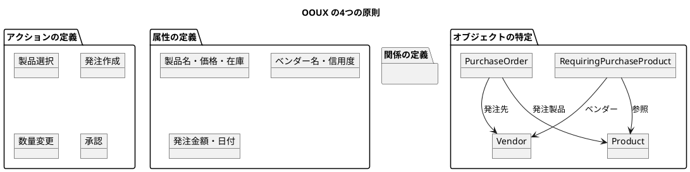

### UI 設計方針

1. **ユーザー中心設計**: 購買担当者のワークフローに最適化
2. **直感的操作**: オブジェクトの関係を視覚的に表現
3. **効率性**: 最小限のクリックで主要タスクを完了
4. **一貫性**: 統一されたデザインパターンとインタラクション
5. **アクセシビリティ**: キーボードナビゲーションとスクリーンリーダー対応

---

## UI オブジェクト分析

### 1. 主要UI オブジェクト

#### RequiringPurchaseProduct（要再発注製品）
**属性**:
- ProductName（製品名）
- VendorName（ベンダー名）
- CurrentStock（現在在庫）
- RecommendedQuantity（推奨発注数量）
- UnitPrice（単価）
- SubTotal（小計）

**アクション**:
- 選択/選択解除
- 詳細表示
- 発注への追加

#### PurchaseOrder（発注）
**属性**:
- VendorInfo（ベンダー情報）
- OrderItems（発注品目）
- SubTotal（小計）
- TaxAmount（税額）
- Freight（送料）
- TotalDue（総額）

**アクション**:
- 品目の数量変更
- 配送方法選択
- 発注実行
- キャンセル

#### Vendor（ベンダー）
**属性**:
- Name（名前）
- AccountNumber（アカウント番号）
- CreditRating（信用度）
- IsPreferredVendor（優先ベンダーフラグ）
- TaxRate（税率）

**アクション**:
- 詳細表示
- 取扱製品確認

### 2. UI オブジェクト関係図

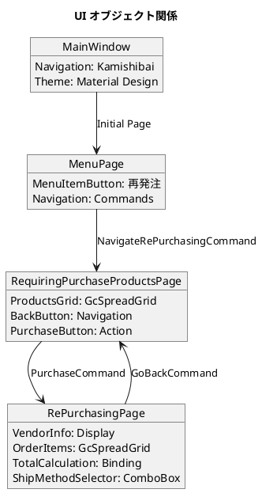

---

## 画面設計

### 1. メインナビゲーション画面

**目的**: システムの主要機能へのアクセスポイント

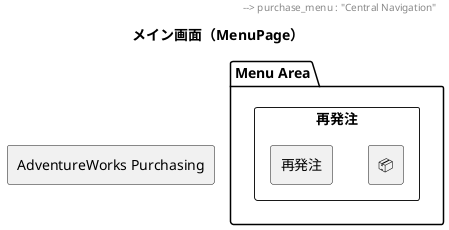

**UI コンポーネント**:
- `MenuItemButton`: カスタムユーザーコントロール
  - Icon: FontAwesome アイコン（OpencartBrands）
  - Label: "再発注"
  - Command: `NavigateRePurchasingCommand`
  - Style: 立体的なボタン（DropShadowEffect）

### 2. 要再発注製品一覧画面

**目的**: 発注が必要な製品の確認と選択

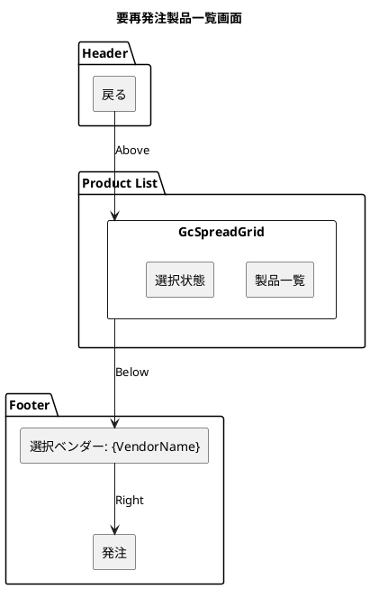

**UI コンポーネント**:
- **Header**:
  - 戻るボタン（`GoBackCommand`）
- **Product Grid**:
  - `GcSpreadGrid`: 高機能データグリッド
  - 単一選択モード
  - 外部SGXML定義でカラム設定
- **Footer**:
  - 選択されたベンダー名の表示
  - 発注ボタン（選択時のみ有効）

### 3. 発注作成画面

**目的**: 具体的な発注内容の確認と実行

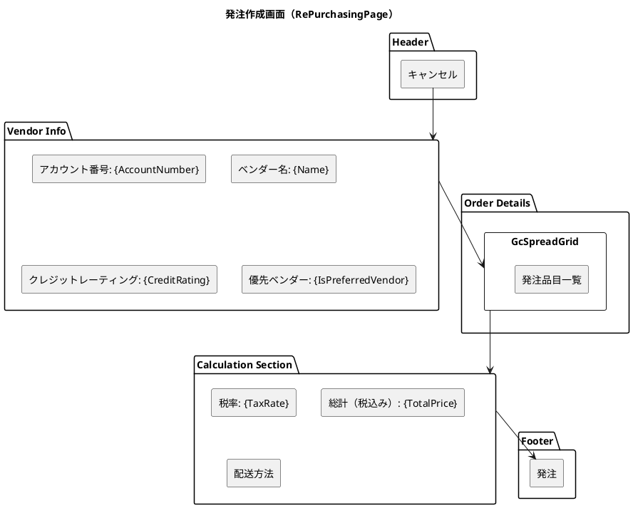

**UI コンポーネント**:
- **Vendor Information**:
  - 2列グリッドレイアウト
  - ラベル：コロン：値の構造
  - 読み取り専用表示
- **Order Items Grid**:
  - `GcSpreadGrid`: 発注品目表示
  - 外部SGXML定義
- **Calculation Panel**:
  - 右寄せレイアウト
  - リアルタイム金額計算
  - 配送方法選択（`C1ComboBox`）

---

## UI コンポーネント設計

### 1. カスタムコントロール

#### MenuItemButton

```xml
<UserControl x:Class="MenuItemButton">
    <Button Width="150" Height="200" Background="White"
            Command="{Binding Command}">
        <Button.Effect>
            <DropShadowEffect Color="MidnightBlue" BlurRadius="12"
                             ShadowDepth="5" Direction="330" />
        </Button.Effect>
        <Grid Margin="10">
            <Grid.RowDefinitions>
                <RowDefinition Height="100"/>
                <RowDefinition Height="*"/>
            </Grid.RowDefinitions>
            <iconPacks:PackIconFontAwesome
                Kind="{Binding Icon}"
                Width="50" Height="50"/>
            <TextBlock Grid.Row="1"
                      Text="{Binding MenuLabel}"
                      Style="{StaticResource ContentTextBlock}"/>
        </Grid>
    </Button>
</UserControl>
```

**特徴**:
- 依存関係プロパティ: `Icon`, `MenuLabel`, `Command`
- 立体的な外観（DropShadowEffect）
- FontAwesome アイコン統合
- 統一されたサイズ（150x200）

### 2. データグリッド設定

#### GcSpreadGrid の活用

```xml
<sg:GcSpreadGrid ItemsSource="{Binding Items}"
                 AutoGenerateColumns="False"
                 DocumentUri="/Component/Grid.sgxml"
                 SelectedItem="{Binding SelectedItem, Mode=OneWayToSource}"/>
```

**特徴**:
- 外部XML定義によるカラム設定
- 高度な表示機能（グループ化、フィルタリング）
- Excel風の操作感
- データバインディング対応

### 3. スタイル定義

#### ボタンスタイル

```xml
<!-- PositiveButton: 実行系アクション -->
<Style x:Key="PositiveButton" TargetType="Button">
    <Setter Property="Background" Value="#4CAF50"/>
    <Setter Property="Foreground" Value="White"/>
    <Setter Property="Padding" Value="15,8"/>
    <Setter Property="Margin" Value="5"/>
</Style>

<!-- NegativeButton: キャンセル系アクション -->
<Style x:Key="NegativeButton" TargetType="Button">
    <Setter Property="Background" Value="#F44336"/>
    <Setter Property="Foreground" Value="White"/>
    <Setter Property="Padding" Value="15,8"/>
    <Setter Property="Margin" Value="5"/>
</Style>
```

---

## MVVM パターン実装

### 1. ViewModel 設計

#### RequiringPurchaseProductsViewModel

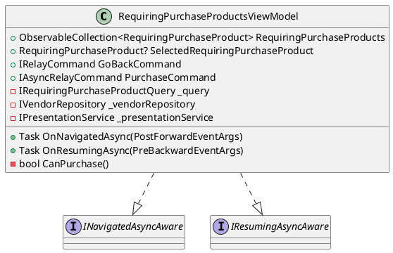

**特徴**:
- CommunityToolkit.Mvvm の活用
- Kamishibai による画面ライフサイクル管理
- 依存性注入によるサービス利用
- 自動コマンド生成（`[RelayCommand]`）

#### RePurchasingViewModel

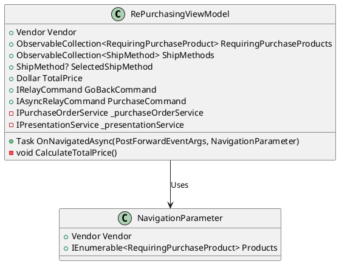

### 2. データバインディング戦略

#### 双方向バインディング

```xml
<!-- 選択状態の管理 -->
<DataGrid SelectedItem="{Binding SelectedItem, Mode=OneWayToSource}">

<!-- コンボボックスの選択 -->
<ComboBox SelectedItem="{Binding SelectedShipMethod, Mode=TwoWay}">

<!-- 読み取り専用チェックボックス -->
<CheckBox IsChecked="{Binding IsPreferred, Mode=OneTime}"
          Style="{StaticResource ReadOnlyCheckBox}">
```

#### コンバーター活用

```xml
<UserControl.Resources>
    <converter:DollarConverter x:Key="DollarConverter"/>
</UserControl.Resources>

<TextBlock Text="{Binding TotalPrice, Converter={StaticResource DollarConverter}}"/>
```

---

## ユーザビリティ設計

### 1. ナビゲーションフロー

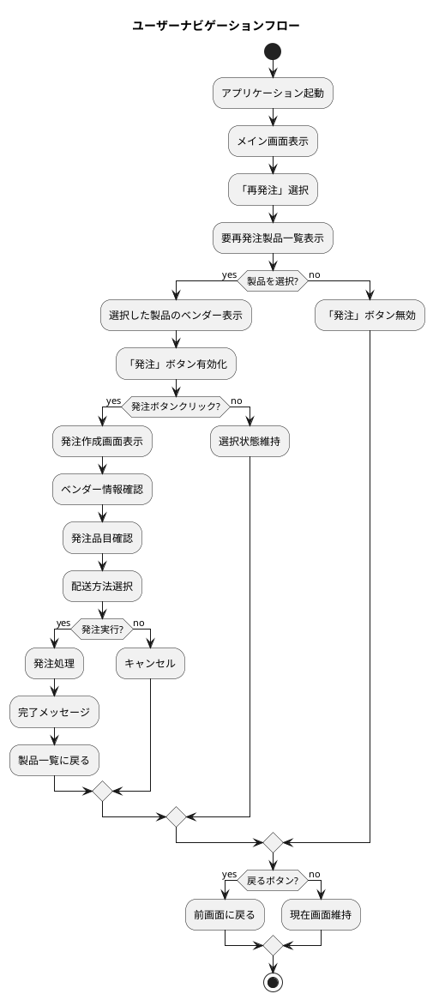

### 2. エラーハンドリングUI

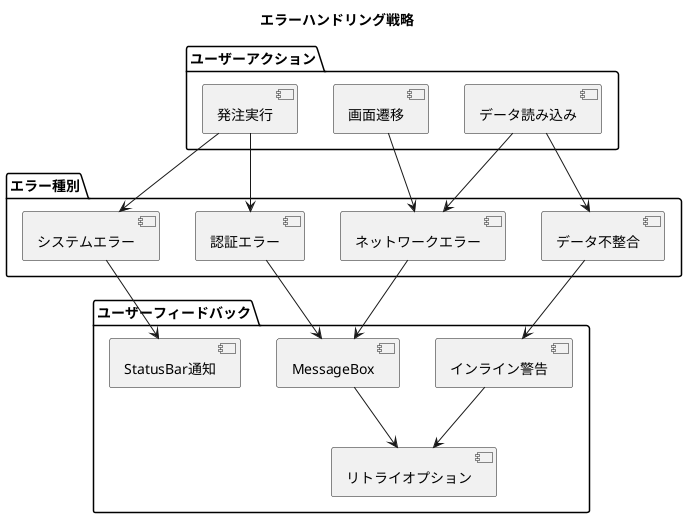

### 3. アクセシビリティ対応

#### キーボードナビゲーション

```xml
<!-- TabIndex による順序制御 -->
<Button Content="戻る" TabIndex="1"/>
<DataGrid ItemsSource="{Binding Products}" TabIndex="2"/>
<Button Content="発注" TabIndex="3"/>

<!-- AutomationProperties による支援技術対応 -->
<Button Content="発注作成"
        AutomationProperties.Name="発注作成ボタン"
        AutomationProperties.HelpText="選択した製品の発注を作成します"
        ToolTip="選択した製品の発注を作成"/>
```

#### カラーアクセシビリティ

```xml
<!-- コントラスト比を考慮したスタイル -->
<Style x:Key="HighContrastButton" TargetType="Button">
    <Setter Property="Background" Value="#0078D4"/>
    <Setter Property="Foreground" Value="White"/>
    <!-- WCAG AA準拠のコントラスト比 4.5:1以上 -->
</Style>
```

---

## レスポンシブデザイン

### 1. 画面サイズ対応

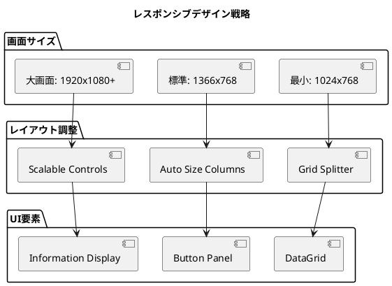

### 2. レイアウト戦略

```xml
<!-- Grid を活用した柔軟レイアウト -->
<Grid>
    <Grid.RowDefinitions>
        <RowDefinition Height="Auto"/>    <!-- Header -->
        <RowDefinition Height="*"/>       <!-- Content -->
        <RowDefinition Height="Auto"/>    <!-- Footer -->
    </Grid.RowDefinitions>

    <Grid.ColumnDefinitions>
        <ColumnDefinition Width="Auto"/>  <!-- Fixed width -->
        <ColumnDefinition Width="*"/>     <!-- Flexible -->
        <ColumnDefinition Width="200"/>   <!-- Min width -->
    </Grid.ColumnDefinitions>
</Grid>
```

---

## パフォーマンス最適化

### 1. データ仮想化

```xml
<!-- 大量データ対応 -->
<DataGrid VirtualizingPanel.IsVirtualizing="True"
          VirtualizingPanel.VirtualizationMode="Recycling"
          ItemsSource="{Binding LargeDataSet}"/>

<!-- GcSpreadGrid による高速描画 -->
<sg:GcSpreadGrid EnableVirtualization="True"
                 LazyLoading="True"
                 ItemsSource="{Binding Products}"/>
```

### 2. 非同期UI更新

```csharp
// ViewModel での非同期データ読み込み
[RelayCommand]
private async Task LoadProductsAsync()
{
    try
    {
        IsLoading = true;

        // バックグラウンドでデータ取得
        var products = await _query.GetRequiringPurchaseProductsAsync();

        // UIスレッドで更新
        Application.Current.Dispatcher.Invoke(() =>
        {
            RequiringPurchaseProducts.Replace(products);
        });
    }
    finally
    {
        IsLoading = false;
    }
}
```

---

## 今後の拡張計画

### 1. 追加画面

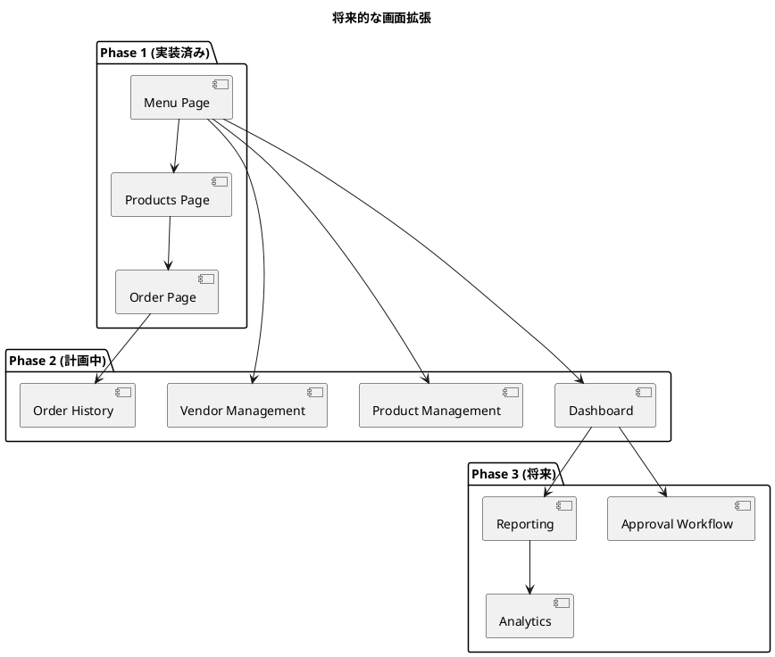

### 2. 機能強化

- **検索・フィルタリング**: 高度な検索条件による製品絞り込み
- **一括操作**: 複数製品の一括発注
- **承認ワークフロー**: 発注承認プロセスの実装
- **通知機能**: システム通知とアラート
- **テーマ切り替え**: ライト・ダークテーマ対応
- **多言語対応**: 国際化（i18n）機能

---

## まとめ

本UI設計では、以下の主要な設計決定を行いました：

1. **オブジェクト指向UI設計の採用**: ユーザーが操作するオブジェクト中心の直感的設計
2. **MVVM パターンの徹底**: ViewとViewModelの明確な分離
3. **カスタムコントロールの活用**: 再利用可能なUIコンポーネント
4. **データグリッドの最適化**: GcSpreadGridによる高機能表示
5. **アクセシビリティ対応**: 支援技術との互換性確保
6. **レスポンシブデザイン**: 様々な画面サイズへの対応
7. **パフォーマンス最適化**: 仮想化と非同期処理による高速化

この設計により、使いやすく、保守性が高く、拡張可能な購買管理システムのUIを実現します。