# 要件定義 - AdventureWorks 購買管理システム

## システム価値

### システムコンテキスト

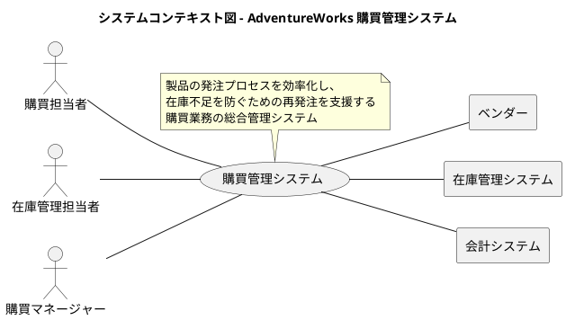

### 要求モデル

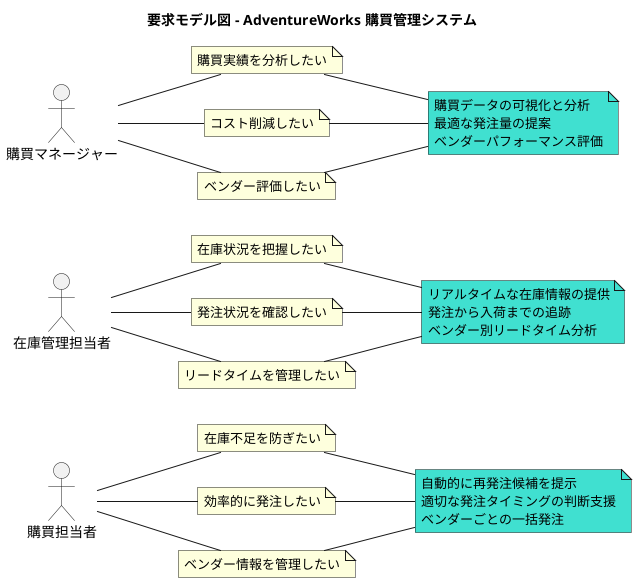

## システム外部環境

### ビジネスコンテキスト

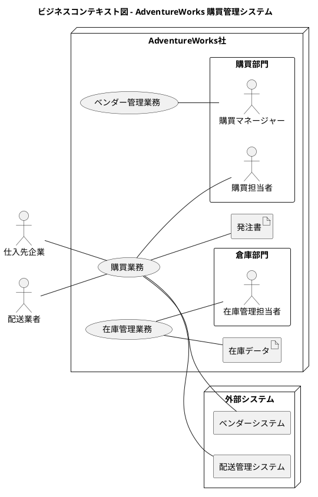

### ビジネスユースケース

#### 購買業務

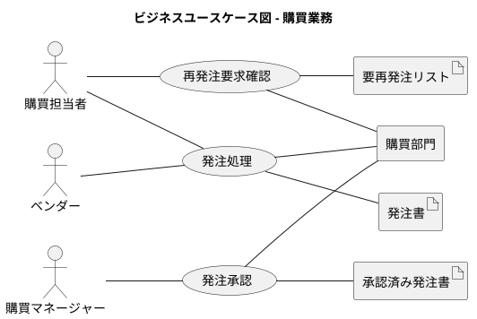

#### 在庫管理業務

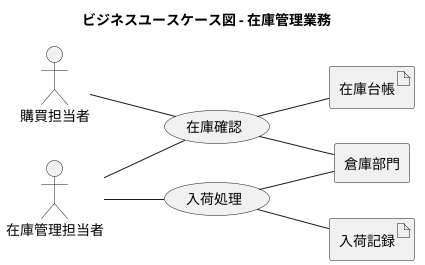

### 業務フロー

#### 再発注処理の業務フロー

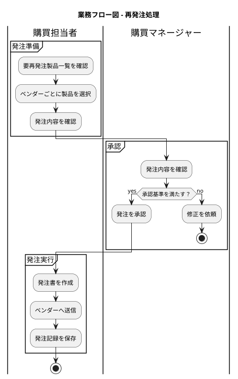

#### 在庫確認の業務フロー

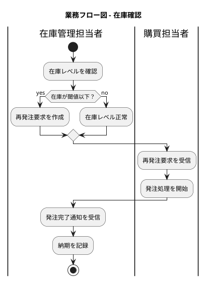

### 利用シーン

#### 再発注処理の利用シーン

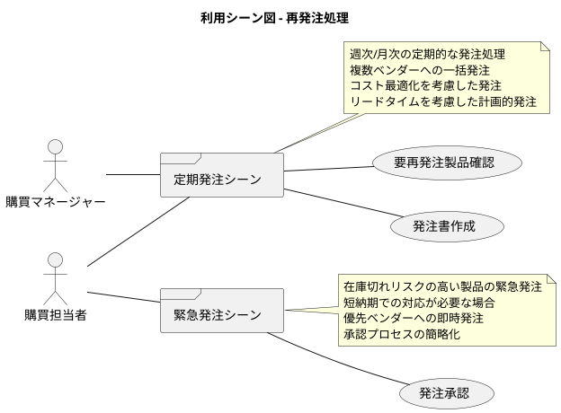

### バリエーション・条件

#### ベンダー種別

| 分類 | 説明 |
|------|------|
| 優先ベンダー | 信頼性が高く、優先的に発注を行うベンダー |
| 通常ベンダー | 一般的な取引条件のベンダー |
| スポットベンダー | 特定の製品や緊急時のみ利用するベンダー |

#### 発注種別

| 分類 | 説明 |
|------|------|
| 定期発注 | スケジュールに基づく計画的な発注 |
| 補充発注 | 在庫水準に基づく自動的な発注 |
| 緊急発注 | 在庫切れリスクに対応する即時発注 |

#### 承認レベル

| 分類 | 説明 |
|------|------|
| 自動承認 | 一定金額以下の定期発注 |
| 一次承認 | 購買担当者による承認が必要 |
| 二次承認 | 購買マネージャーによる承認が必要 |

## システム境界

### ユースケース複合図

#### 再発注処理

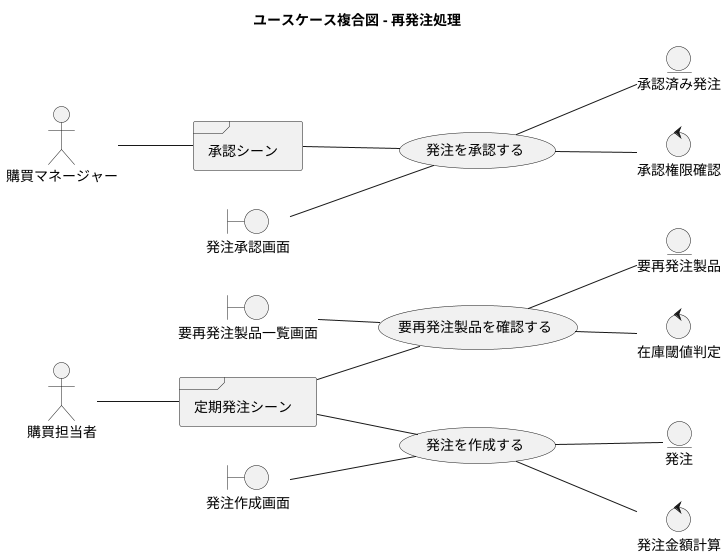

#### 在庫管理

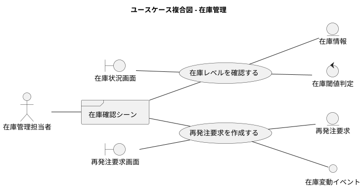

## システム

### 情報モデル

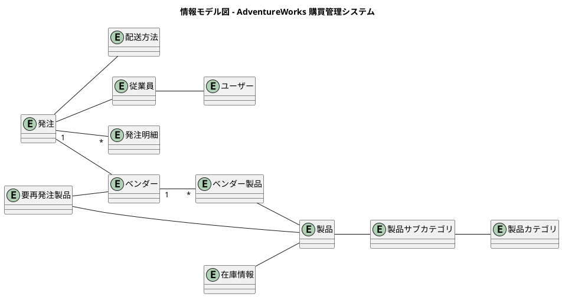

### 状態モデル

#### 発注の状態遷移

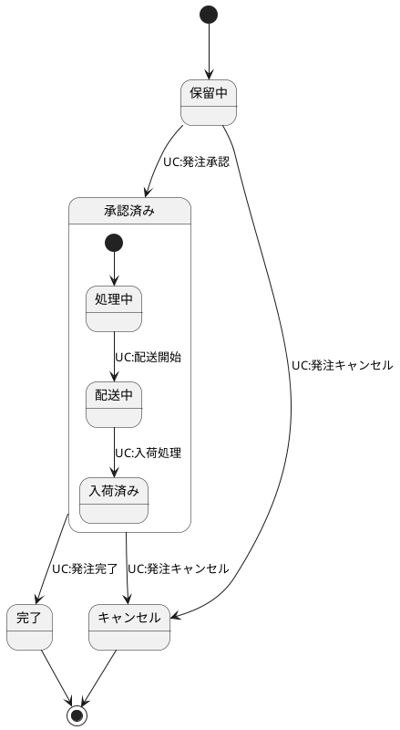

#### 在庫の状態遷移

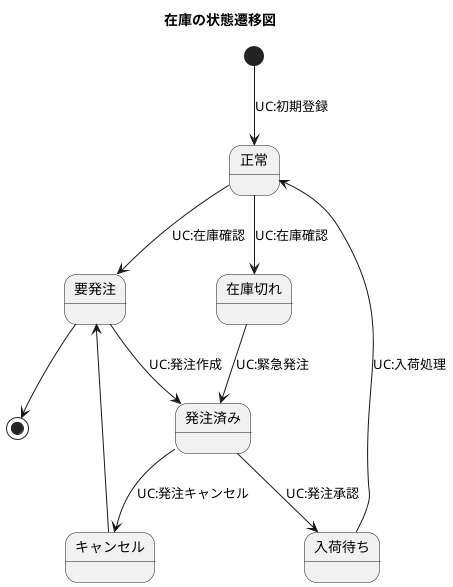

---

## 記入ガイドに基づく補足説明

### システムの目的とビジョン

AdventureWorks 購買管理システムは、製品の発注プロセスを効率化し、適切な在庫水準を維持することで、ビジネスの継続性を確保します。特に再発注処理の自動化により、在庫切れリスクの削減と購買業務の効率化を実現します。

### ドメイン用語集

- **要再発注製品 (RequiringPurchaseProduct)**: 在庫レベルが閾値を下回り、発注が必要な製品
- **ベンダー (Vendor)**: 製品の仕入先となる取引先企業
- **リードタイム (LeadTime)**: 発注から納品までに要する日数
- **発注承認 (Purchase Approval)**: 発注金額や条件に基づく上位者による承認プロセス
- **在庫閾値 (Inventory Threshold)**: 再発注が必要となる在庫数量の基準値

### トレーサビリティ

本要件定義書は、実際のソースコードから抽出されたドメインモデルとユースケースに基づいて作成されています。各エンティティとその関係性は、実装されているクラス構造と対応しており、開発フェーズでの詳細設計に直接活用できます。